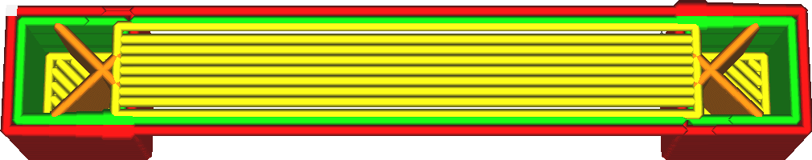

Doorvoer brugskin
====
Deze instelling regelt de hoeveelheid materiaal die wordt geëxtrudeerd om de onderkant van de bruggen te printen.

<!--screenshot {
"image_path": "bridge_skin_density_100.png",
"modellen": [{"script": "bridge.scad"}],
"laag": 80,
"instellingen": {
    "bridge_settings_enabled": waar,
    "bridge_skin_density": 100,
    "bridge_skin_material_flow": 100,
    "bridge_wall_material_flow": 100
},
"camerapositie": [0, 18, 79],
"kleuren": 64
}-->
<!--screenshot {
"image_path": "bridge_skin_material_flow_50.png",
"modellen": [{"script": "bridge.scad"}],
"laag": 80,
"instellingen": {
    "bridge_settings_enabled": waar,
    "bridge_skin_density": 100,
    "bridge_skin_material_flow": 50,
    "bridge_wall_material_flow": 100
},
"camerapositie": [0, 18, 79],
"kleuren": 64
}-->

Het verminderen van de hoeveelheid materiaal vermindert effectief de lijnbreedte aan de onderkant en overbrugt een opening. Met een kleinere lijnbreedte is de verhouding tussen oppervlakte en massa van de lijnen groter, waardoor ze sneller kunnen afkoelen en minder doorzakken.

Het te veel verlagen van de doorvoer zal echter resulteren in een grote verandering in de doorvoer, vooral in combinatie met een [Snelheid brugskin](bridge_skin_speed.md). In werkelijkheid kan het materiaal zijn doorvoer niet erg snel veranderen, waardoor de lijnen iets dikker zijn dan bedoeld wanneer de doorvoer wordt vertraagd en iets dunner dan bedoeld wanneer de doorvoer wordt verhoogd.