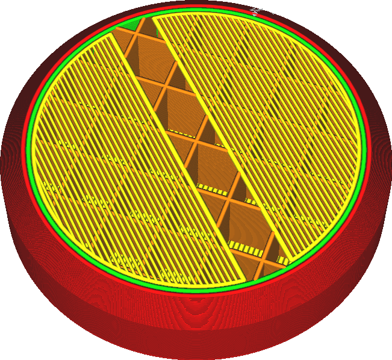

Maximale dichtheid van dunne vulling brugskin
====
Als u printt met een zeer lage opvuldichtheid, zal de skin de neiging hebben om door te hangen, wat resulteert in [Pillowing](../troubleshooting/pillowing.md) en algemene onregelmatige oppervlakken aan de bovenkant van de print. Eventueel kunnen de overbruggingstechnieken ook op de buitenskin worden toegepast. Deze instelling bepaalt vanaf welke vulling de overbruggingstechniek moet worden toegepast.

<!--screenshot {
"image_path": "bridge_sparse_infill_max_density.png",
"modellen": [
    {
        "script": "stempel.scad",
        "transformatie": ["schaal(0.5)"]
    }
],
"laag": 108,
"instellingen": {
    "bridge_settings_enabled": waar,
    "bridge_sparse_infill_max_density": 100
},
"camerapositie": [58, 27, 104],
"kleuren": 64
}-->

Deze instelling is geconfigureerd als een drempel zodat de profielen één waarde bevatten. Omdat de gebruiker de vuldichtheid voortdurend aanpast, wordt overbrugging voor de skin automatisch in- of uitgeschakeld.

Het overbruggen van de skin resulteert over het algemeen in een gladder oppervlak bij zeer lage vulsnelheden. Zorg er echter voor dat er voldoende [Bovenlagen](../top_bottom/top_layers.md) zijn om het oppervlak goed af te sluiten zonder de overbruggingstechniek op de toplagen te gebruiken. De overbruggingstechniek, vooral met verminderde [Doorvoer derde brugskin](bridge_skin_material_flow_3.md), zal het oppervlak niet volledig sluiten. Als de bovenste skin niet genoeg lagen heeft, verschijnen er gaten in de print en komt de sterkte in gevaar.