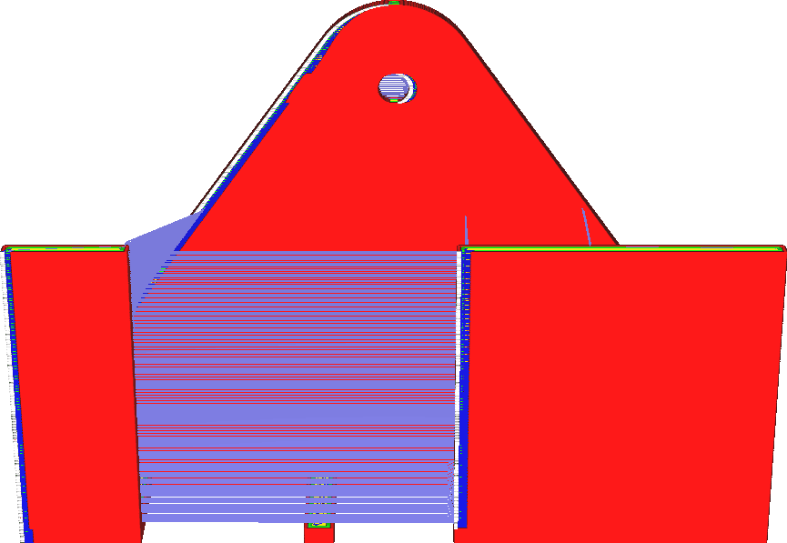

Coasting-volume
====
Deze instelling bepaalt hoe ver voor het einde van de contour de transporteur stopt met het doorvoer van materiaal. De lengte van de uitloop is echter geconfigureerd in een materiaalvolume. Het hangt nauwer samen met het volume in de nozzlekamer.

<!--screenshot {
"image_path": "coasting_enable.png",
"modellen": [{"script": "phone_holder.scad"}],
"camerapositie": [0, -215, 117],
"minimum_laag": 1,
"structuren": ["reizen", "helpers", "shell", "infill", "starts"],
"instellingen": {
    "coasting_enable": waar,
    "coasting_volume": 0.06,
    "z_seam_position": "backright"
},
"kleuren": 32
}-->
<!--screenshot {
"image_path": "coasting_volume_0_03.png",
"modellen": [{"script": "phone_holder.scad"}],
"camerapositie": [0, -215, 117],
"minimum_laag": 1,
"structuren": ["reizen", "helpers", "shell", "infill", "starts"],
"instellingen": {
    "coasting_enable": waar,
    "coasting_volume": 0.03,
    "z_seam_position": "backright"
},
"kleuren": 32
}-->

Door het Coastingvolume te vergroten, stopt de nozzle met extruderen voordat de contour is voltooid. Het resultaat is meer onder-extrusie naar het einde toe. De functie van vrijloop is om de klodder te compenseren wanneer de contour sluit, dus het vergroten van het vrijloopvolume kan grotere klodders compenseren.

Het te veel vergroten van het uitloopvolume zal echter leiden tot ernstige onder-extrusie aan het einde van de contour. Het kan zelfs leiden tot enige onder-extrusie van alles dat na contour wordt geprint, omdat de druk op de nozzle dan nog laag is.