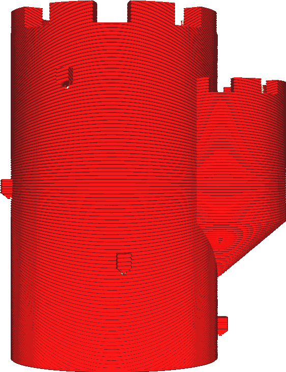

Overhang Printbaar Maken
====
Met deze instelling wordt uw model zodanig getransformeerd dat het geen overhang meer heeft. Extra materiaal wordt onder de overhang geplaatst en geprint alsof het deel uitmaakt van het model.

<!--screenshot {
"image_path": "conical_overhang_enabled_disabled.png",
"modellen": [{"script": "kasteel.scad"}],
"camerapositie": [0, 189, 25],
"instellingen": {
    "conical_overhang_enabled": false
},
"kleuren": 8
}-->
<!--screenshot {
"image_path": "conical_overhang_enabled_enabled.png",
"modellen": [{"script": "kasteel.scad"}],
"camerapositie": [0, 189, 25],
"instellingen": {
    "conical_overhang_enabled": waar,
    "conical_overhang_angle": 50
},
"kleuren": 8
}-->

Onder alle overhangende delen wordt materiaal geplaatst, dat naar beneden toe steeds kleiner wordt. In veel gevallen zal de overstek aflopen naar het object zelf. De helling waarop de overhang naar het object toe groeit, wordt bepaald door de [Maximale Modelhoek](conical_overhang_angle.md).

Deze instelling is een gemakkelijke manier om de noodzaak van support te voorkomen. Deze instelling is vooral effectief bij het printen van modellen met enigszins ruwe oppervlakken of reliëf op de zijkanten. Deze kleine stukjes overhang zouden normaal gesproken naar beneden hangen, waardoor losse strengen van onsamenhangende plastic draad ontstaan. Er kan een back-up van worden gemaakt met enige support, maar dit kan lang duren om printen en toch wat littekens achterlaten. Als deze instelling is ingeschakeld, wordt de overhang naar het model toe afgevlakt. Het ziet er dan naar uit dat het zo moet worden geprint.

Als de overhang verder van het hoofdlichaam reikt dan breed, kan toch een overhang in de vorm van een lijn ontstaan. Dit gebeurt omdat het supernatant dan oneindig dun wordt gekskinen, waardoor het verdwijnt. In dit geval kunt u overwegen of het nog nodig is om support printen. In het geval van de bovenstaande afbeeldingen is dit het geval met de kleine blokjes aan de zijkant van de toren, maar deze is zo klein dat hij met een simpele overbrugging waarschijnlijk gemakkelijk kan overhangen.
Als de overhang verder uitsteekt dan de breedte, kan dit nog steeds leiden tot een overhang in de vorm van een lijn. Dit gebeurt doordat de uitstulping vervolgens oneindig dun wordt gekrompen, waardoor deze verdwijnt. Als dit gebeurt, kunt u overwegen of het misschien nog steeds nodig is om een support te printen. In het geval van de bovenstaande afbeeldingen gebeurt dit met de kleine blokken aan de zijkant van de toren, maar het is zo klein dat een eenvoudige overbrugging het waarschijnlijk goed zal laten overhangen.