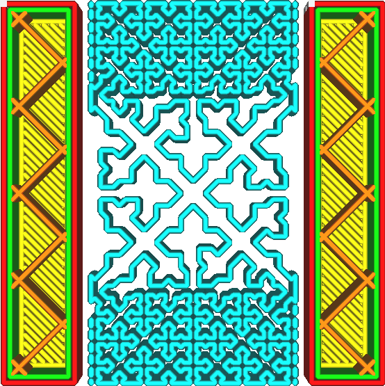

Dichtheid kruisvulling afbeelding voor supportstructuur
====
Met deze instelling kunt u een afbeelding specificeren die de dichtheid op verschillende locaties op de drager aangeeft. De dichtheid van de drager varieert op bepaalde plaatsen, afhankelijk van de helderheid van het beeld. Dit werkt alleen voor het [Patroon Supportstructuur](../support/support_pattern.md) omdat dit patroon de dichtheid kan aanpassen zonder lijnen te snijden, wat zou resulteren in een onderbroken doorvoer en verminderde sterkte.

<!--screenshot {
"image_path": "cross_support_density_image.png",
"modellen": [{"script": "wide_bridge.scad"}],
"camerapositie": [0, 0, 120],
"laag": 79,
"instellingen": {
    "support_enable": waar,
    "support_pattern": "kruis",
    "support_infill_rate": 100,
    "cross_support_density_image": "{root}/resources/articles/images/cross_support_density_image_mask.png"
},
"kleuren": 32
}-->

Het pad naar de afbeelding wordt gespecificeerd als een lokaal pad, bijvoorbeeld `C:\Projects\3D Printing\infill_density.png` op Windows of `/home/ghostkeeper/3d_printing/infill_density.png` op Unix. Ondersteunde bestandsindelingen zijn JPG, PNG, TGA, BMP, PSD, GIF, HDR en PIC. De afbeelding wordt over het object geschaald zodat het precies binnen het selectiekader van het object past. De helderheid van de afbeelding bepaalt de dichtheid van de vulling:
* Als de afbeelding zwart is, wordt de [Dichtheid Supportstructuur](../support/support_infill_rate.md) gebruikt.
* Als de afbeelding wit is, benadert de dragerdichtheid 0%.

De supportdichtheid zal nooit de waarde overschrijden die is opgegeven in [Lijnafstand Supportstructuur](../support/support_line_distance.md). Het kan alleen worden verminderd. Het patroon is ook beperkt in waar het zijn dichtheid kan verminderen. Hoewel het de gewenste supportdichtheid zo goed mogelijk probeert te benaderen, is dit niet altijd mogelijk. Wanneer de dragerdichtheid erg laag is, is er bijzonder weinig gelegenheid om de dragerdichtheid aan te passen, waardoor de print de afbeelding zeer losjes volgt. Op plaatsen waar de supportdichtheid hoog is, wordt het beeld zeer nauwkeurig gevolgd. De geselecteerde dichtheid is ook sterk gekwantificeerd. De dichtheid kan alleen worden verdubbeld of gehalveerd, maar Cura [dither](https://en.wikipedia.org/wiki/Dither) het patroon voor een grotere effectieve nauwkeurigheid.

Met deze instelling kunt u uw support zeer breed aanpassen. Als bepaalde delen van uw print gevoelig zijn voor doorzakken of zeer nauwkeurig moeten worden geprint, kunt u de dichtheid daar lokaal verhogen om ze beter te ondersupporten zonder printtijd op te offeren of het verwijderen van de support moeilijker te maken.  

**Deze instelling vertaalt zich niet goed in Cura-projectbestanden. Het projectbestand slaat het pad naar de afbeelding op als een instellingswaarde, maar niet de afbeelding. Als het projectbestand op een andere computer wordt geopend, wordt de dichtheidsafbeelding waarschijnlijk niet hersteld.**