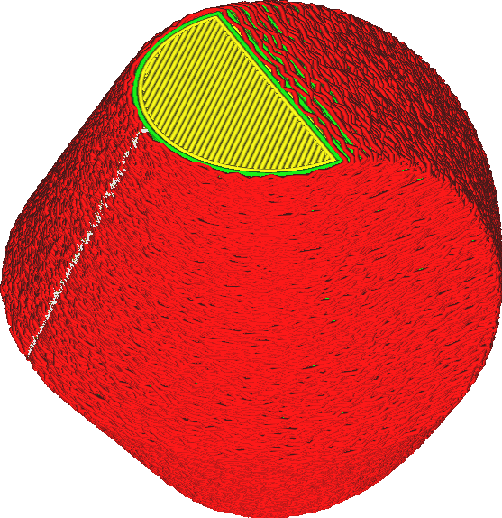

Rafelig Oppervlak
====
Wanneer u met een ongelijkmatige skin print, wordt het oppervlak aan de zijkanten van de print opzettelijk opgeruwd. Dit geeft de print een soort textuur.

<!--screenshot {
"image_path": "magic_fuzzy_skin_enabled.png",
"modellen": [{"script": "hexasphericon.scad"}],
"camerapositie": [-61, 112, 136],
"instellingen": {
    "magic_fuzzy_skin_enabled": true
},
"kleuren": 32
}-->

Deze modus voegt een willekeurige rimpeling toe aan de buitenwand. De printkop trilt willekeurig tijdens het printen van de buitenwand. Hierdoor voelt het oppervlak ruw aan. Het oppervlak is alleen aan de zijkanten van de print ongelijk. De bovenkant zal niet ongelijk zijn.

Door de oneffenheden wordt de maatnauwkeurigheid niet meer gegeven. De druk zal zeker groter zijn dan het originele model. De oneffen buitenskin zorgt er ook voor dat de print langer duurt omdat de printkop veel versnelt bij het printen van de buitenwand.