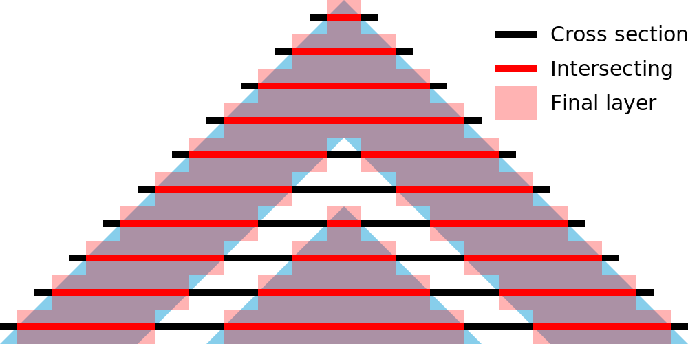
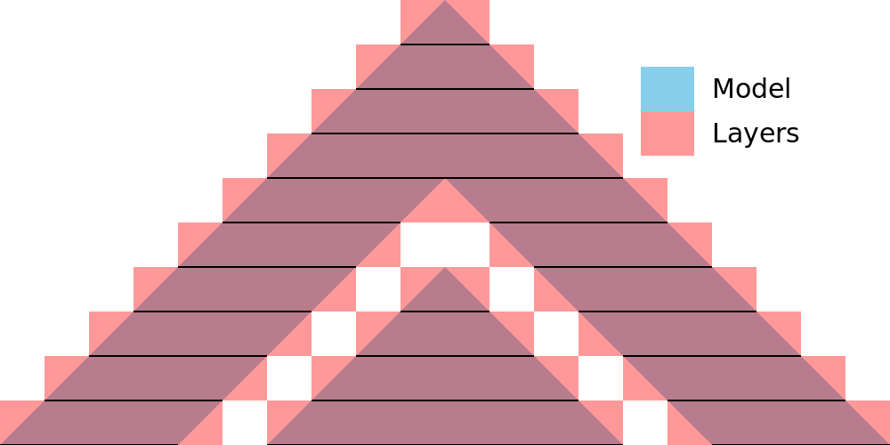
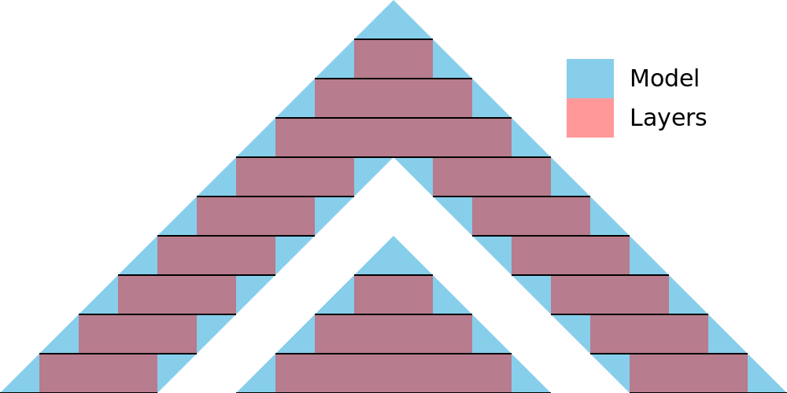

Slicetolerantie
====
Met de Slicetolerantie kunt u instellen hoe u omgaat met de onnauwkeurigheid van het verdelen van een mesh in een beperkt aantal lagen. U kunt ervoor kiezen om de lagen het oppervlak te laten naderen, door het oppervlak begrensd te blijven of het oppervlak volledig te omsluiten.

Centrum
----

Bij gebruik van centrum blijven de lagen zo dicht mogelijk bij het oorspronkelijke oppervlak. Dit betekent dat de lagen soms boven het oorspronkelijke oppervlak uitsteken en soms in het oorspronkelijke oppervlak zakken. Over het algemeen zal het volume van de lagen zeer dicht bij het volume van de originele mesh liggen.

Om de gemiddelde tolerantie te krijgen, berekent Cura een doorsnede door de helft van de dikte van elke laag. Alles wat binnen de doorsnede ligt, wordt onderdeel van de laag.

Inclusief
----

Bij gebruik van inclusief bevatten de lagen *minstens* het gehele originele volume. Als het oppervlak schuin staat, zullen de lagen iets uitsteken. Het totale volume van de lagen zal bijna altijd groter zijn dan het volume van de originele mesh.

Om de inclusieve tolerantie te krijgen, berekent Cura doorsneden aan de boven- en onderkant van de hoogte van elke laag. Alle vlakken die zich in *één* van deze doorsneden bevinden, worden beschouwd als onderdeel van de laag. Kleine details die tussen de twee doorsneden liggen, worden nog steeds genegeerd omdat ze kleiner zijn dan één laaghoogte.

Exclusief
----

Als Exclusief wordt gebruikt, worden de lagen in het oorspronkelijke volume opgenomen. Wanneer het oppervlak wordt gekanteld, zijn de lagen iets kleiner dan het oorspronkelijke volume. Het totale volume van de lagen zal bijna altijd kleiner zijn dan het volume van de originele mesh.

Om de exclusieve tolerantie te krijgen, berekent Cura doorsneden aan de boven- en onderkant van de hoogte van elke laag. Alleen vlakken die zich in *beide* van deze doorsneden bevinden, worden als onderdeel van de laag beschouwd.

Gebruiken
----
Deze instelling is genoemd naar het doel en niet naar het functionele effect. Als je meerdere onderdelen hebt die langs elkaar moeten schuiven, kan de theoretische vorm van de lagen een exacte pasvorm fysiek verhinderen. In een dergelijk geval kunt u deze instelling op Exclusief instellen om ervoor te zorgen dat de slices binnen de grenzen van het oorspronkelijke volume blijven. Behoudens kromtrekken, uitzakken en soortgelijke vervormingseffecten, zou dit garanderen dat de onderdelen zouden passen en langs elkaar zouden kunnen schuiven.

In werkelijkheid zijn er altijd andere effecten die dit voorkomen. In de praktijk kan deze instelling worden gebruikt om iets meer of minder tolerantie te bereiken tussen twee hellende vlakken, zoals te zien is in de bovenstaande afbeeldingen.
