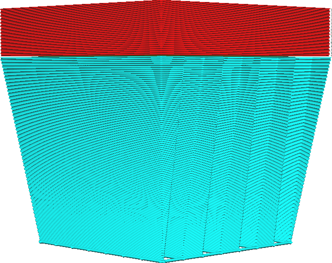

Hoek Conische Supportstructuur
====
Deze instelling bepaalt de kantelhoek waaronder de conische draagstructuur wordt geprint.

<!--screenshot {
"image_path": "support_conical_enabled.png",
"modellen": [
    {
        "script": "wide_overhang.scad",
        "transformatie": ["schaal(0.5)"]
    }
],
"camerapositie": [91, -95, 19],
"instellingen": {
    "support_enable": waar,
    "support_conical_enabled": waar,
    "support_conical_angle": 30
},
"kleuren": 64
}-->
<!--screenshot {
"image_path": "support_conical_angle_10.png",
"modellen": [
    {
        "script": "wide_overhang.scad",
        "transformatie": ["schaal(0.5)"]
    }
],
"camerapositie": [91, -95, 19],
"instellingen": {
    "support_enable": waar,
    "support_conical_enabled": waar,
    "support_conical_angle": 10
},
"kleuren": 64
}-->
<!--screenshot {
"image_path": "support_conical_angle_neg10.png",
"modellen": [
    {
        "script": "wide_overhang.scad",
        "transformatie": ["schaal(0.5)"]
    }
],
"camerapositie": [91, -95, 19],
"instellingen": {
    "support_enable": waar,
    "support_conical_enabled": waar,
    "support_conical_angle": -10
},
"kleuren": 64
}-->

De conische supporthoek is de belangrijkste afweging tussen de stabiliteit van de support en de hoeveelheid support die wordt gegenereerd.

Als u een grote hoek gebruikt, wordt de support over een groot deel van de hoogte erg dun. Dit scheelt veel supportsmateriaal en printtijd. Als er veel supportmateriaal nodig is, kan dit veel tijd en materiaal besparen, aangezien meer dan de helft van het supportmateriaal wordt weggelaten. Omdat de drager echter aan de onderkant erg dun wordt, kan de drager ook minder stabiel worden, waardoor de kans op het mislukken van de print groter wordt. Om dit te voorkomen, kunt u de [Minimale Breedte Conische Supportstructuur](support_conical_min_width.md) vergroten.

Als je een negatieve hoek gebruikt, wordt de support naar beneden toe breder en heeft deze de vorm van een vulkaan. Als je print kleine high-top elementen bevat die support nodig hebben, resulteert dit meestal in zeer hoge [Pijlers Gebruiken](../support/support_use_towers.md) die gemakkelijk kunnen omvallen tijdens het printen. Met een negatieve hoek worden deze hoge, dunne supportstructuren naar beneden toe breder. Dit geeft ze extra stabiliteit. Het printen van deze dragers duurt echter langer omdat er meer materiaal nodig is. Een hoek van ongeveer -5° is meestal voldoende om zelfs de hoogste en dunste draagconstructies voldoende stabiliteit te geven. Als uw materiaal de neiging heeft om tijdens de beweging sterk te sijpelen, is een grotere negatieve hoek vereist,