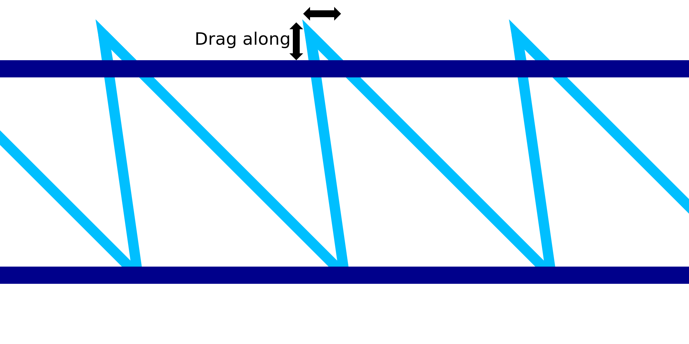

Meeslepen Draadprinten
====
Bij het printen van de diagonale neerwaartse beweging van het zaagtandpatroon voor draadprinten, heeft het materiaal de neiging om een ​​beetje mee te slepen. Deze instelling compenseert dit effect door de vorm van het zaagtandpatroon enigszins te veranderen. De punten van de tanden worden naar boven en naar achteren gebracht.

De punten van de tanden worden precies in de tegenovergestelde richting van de neerwaartse diagonale beweging bewogen. Hopelijk, terwijl het materiaal wordt voortgesleept, zullen de toppen van het zaagtandpatroon op hun beoogde plaats terechtkomen.

Als het goed is afgesteld, wordt het zaagtandpatroon nauwkeuriger geprint. Als gevolg hiervan zal de volgende horizontale ring die bovenop het zaagtandpatroon wordt geplaatst, niet zo ver doorhangen als anders het geval zou zijn. De hele structuur wordt stabieler en het printen wordt betrouwbaarder.