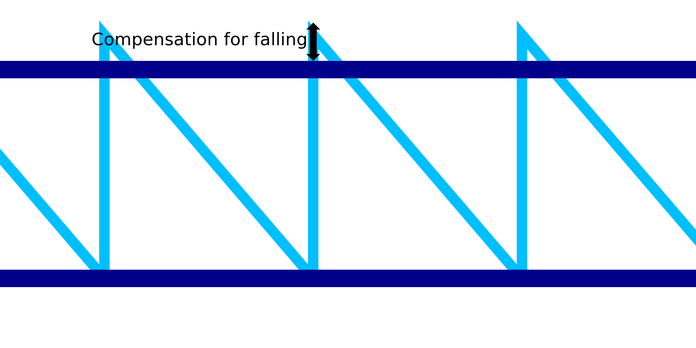

Valafstand Draadprinten
====
Houd er bij het printen van het draadframe rekening mee dat het materiaal doorzakt voordat het door de latente warmte de kans krijgt om te stollen. Dit zou het zaagtandpatroon te kort maken. Terwijl de horizontale ringen kunnen overbruggen door de continue horizontale beweging, kan het zaagtandpatroon dat niet. Deze instelling compenseert de korte gestalte van het zaagtandpatroon door het patroon iets groter te maken, zodat de volgende horizontale ring er goed op rust.

De waarde van de instelling wordt opgeteld bij de hoogte van de zaagtanden. Dit compenseert hopelijk de doorbuiging bij het printen van die zaagtanden. Als de instelling correct is, drukt de horizontale ring stevig bovenop het zaagtandpatroon, in plaats van lager te vallen dan de beoogde printhoogte.

In combinatie met [Meeslepen Draadprinten](wireframe_drag_along.md), wordt de hoogte van het zaagtandpatroon de normale [Verbindingshoogte Draadprinten](wireframe_height.md) plus de waarde van de Drag-instelling plus de waarde van die instelling.