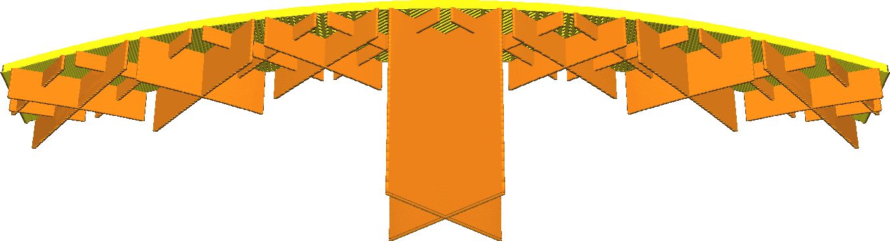

Staphoogte Geleidelijke Vulling
====
Bij een geleidelijke vulling wordt de dichtheid van de vulling in meerdere stappen van boven naar beneden verminderd. Bij elke stap wordt de dichtheid van de vulling gehalveerd. Deze instelling specificeert de hoogte van deze treden, wat de afstand is tussen twee plaatsen waar de vulling in tweeën wordt gedeeld.

Bij geleidelijke vulstappen blijft een deel van de vulling natuurlijk in de lucht hangen. Meestal corrigeert dit echter zichzelf: de eerste laag vulling hangt in de lucht en hecht alleen goed aan de zijkanten van de print. De lagen die erop zijn geplaatst kunnen aan de uiteinden een beetje op de vorige laag rusten, maar zullen in het midden doorzakken. Dit wordt geleidelijk beter, laag voor laag.

* Verklein de incrementele vulling-stapgrootte om snel een lage vulling-dichtheid te krijgen. Dit bespaart printtijd en materiaalverbruik.
* Verhoog de incrementele vulstapgrootte als de vulling niet genoeg ruimte heeft om zichzelf te corrigeren wanneer de volgende stap in opvuldichtheid plaatsvindt. Als u de waarde van deze instelling verhoogt, wordt het printen betrouwbaarder.