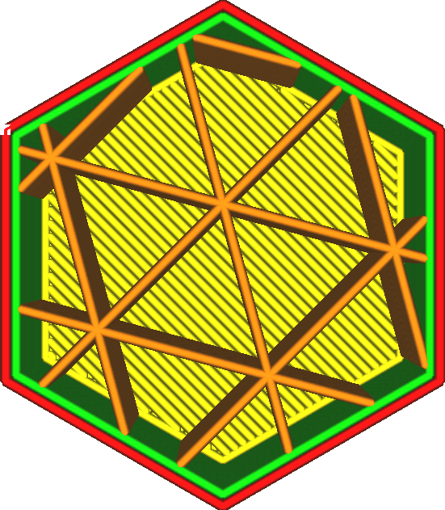

Vulling Y-offset 
====
Normaal gesproken zijn de opvulpatronen gecentreerd in het midden van het 3D-model. Deze instelling, samen met de [Vulling X-Offset](infill_offset_x.md), maakt het mogelijk om het middelpunt van het patroon te verschuiven. Deze instelling past de Y-coördinaat van het middelpunt aan.

Wanneer u print met een lage vuldichtheid, kunt u de vulling zeer nauwkeurig positioneren, waarbij elke vullijn wordt geplaatst waar de sterkte het meest nodig is.