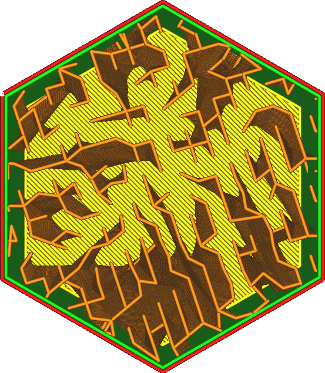
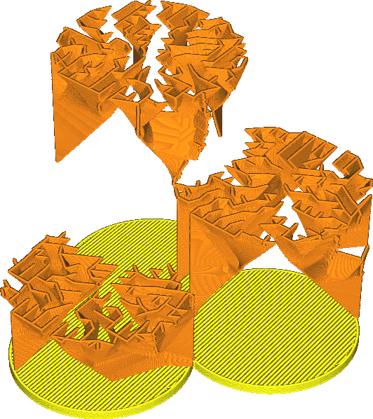

Vulpatroon
====
Het vulpatroon definieert een structuur waarmee het object wordt gevuld. Er zijn verschillende patronen beschikbaar, elk met zijn eigen voordelen. Sommige zijn bedoeld voor zeer specifieke toepassingen.

Raster
----

Het rasteropvulpatroon creëert twee loodrechte lijnen. Samen vormen ze een patroon van vierkanten.
* Sterkste patroon in verticale richting.
* Vrij sterk in de twee richtingen van de lijnen.
* Niet zo sterk in de diagonaal.
* Zeer goede support voor de structuur. Je oppervlak ziet er erg glad uit.

Lijnen
----

Het lijnenpatroon creëert parallelle lijnen. Standaard verandert het lijnpatroon loodrecht van richting van laag naar laag, dus op het eerste gezicht lijkt het op het rasterpatroon. Dit kan echter worden gewijzigd met de instelling [Lijnrichting vulling](infill_angles.md).
* Het beste patroon voor een glad oppervlak samen met zigzag omdat de afstand tussen de lijnen het kleinst is.
* Neigt zwak in de verticale richting omdat de lagen slechts kleine punten hebben waar ze aansluiten.
* Het is extreem zwak in de horizontale richting, behalve in de ene richting waarin de lijnen zijn uitgelijnd. Maar zelfs in die richting is het niet bijzonder bestand tegen afschuiving, dus het zal vrij snel bezwijken onder belasting.

Driehoeken
----

Het driehoekspatroon creëert drie reeksen lijnen in drie verschillende richtingen. Samen vormen ze een patroon van driehoeken.
* Zeer goed bestand tegen afschuiving.
* Ongeveer gelijke sterkte in elke horizontale richting.
* De bovenlijnen moeten zeer lang overbruggen, wat veel skinlagen nodig heeft om een egaal oppervlak te krijgen.
* De doorvoerbeweging wordt ernstig verstoord op kruispunten, wat resulteert in een relatief lage sterkte bij hoge vulsnelheden.

Drie zeshoek
----

Het Drie zeshoek-patroon creëert drie reeksen lijnen in drie verschillende richtingen, net als het Triangle-patroon, maar verschoven van elkaar zodat ze elkaar niet allemaal op dezelfde plaats kruisen.
* Sterkste patroon in horizontale richting.
* Ongeveer gelijke sterkte in elke horizontale richting.
* Zeer goed bestand tegen afschuiving.
* De bovenlijnen moeten zeer lang overbruggen, wat veel skinlagen nodig heeft om een egaal oppervlak te krijgen.

Kubus
----

Het patroon creëert kubussen, een 3-dimensionaal patroon. De kubussen zijn staand op een hoek uitgelijnd, zodat ze kunnen worden geprint zonder overhangende binnenvlakken.
* Ongeveer gelijke sterkte in elke richting, inclusief de verticale richting.
* Redelijk sterk in alle richtingen.
* Verminderde dempende effecten omdat er geen lange verticale holtes zijn gevuld met hete lucht.

Kubus subgebied
----

Het subregiopatroon van de kubus creëert kubussen, een driedimensionaal patroon. De kubussen zijn staand op een hoek uitgelijnd, zodat ze kunnen worden geprint zonder overhangende binnenvlakken. Dit patroon creëert echter grotere kubussen in het volume, wat materiaal bespaart. Het laat de opvullijnen weg waar ze het minst nuttig zijn.

Dit patroon kan resulteren in een lagere vuldichtheid dan gewenst. Het is aan te raden om bij gebruik van dit patroon de vulling-dichtheid drastisch te verhogen. Optimalisatie werkt het beste bij hoge opvullingspercentages.

Dit patroon wordt algoritmisch gegenereerd door een gigantische kubus rond het hele volume te maken, die vervolgens wordt verdeeld in 8 subkubussen wanneer deze een wand raakt. Dit proces wordt vervolgens herhaald, zodat de subkubussen die tegen een wand botsen steeds weer worden onderverdeeld. Dit wordt herhaald totdat de afstand tussen de vullijnen is bereikt.
* Sterkste monster naar gewicht en printtijd.
* Ongeveer gelijke sterkte in elke richting, inclusief de verticale richting.
* De vulling wordt verzameld in dunne delen.
* Verminderd kusseneffect omdat er geen lange verticale holtes zijn gevuld met hete lucht.
* Als een hogere vullingsdichtheid wordt gebruikt, zal de vulling niet zo veel door de wanden heen zichtbaar zijn, wat een betere oppervlaktekwaliteit oplevert voor dezelfde printtijd.
* Leidt tot inkepingen, wat niet goed werkt met flexibele of vloeiende materialen.
* Het slice-proces duurt langer.

Octet
----

Het octetpatroon creëert een combinatie van regelmatige vierkanten en kubussen, een 3-dimensionaal patroon. Op regelmatige afstanden worden meerdere afvullijnen naast elkaar geplaatst.
* Hierdoor ontstaat een sterk binnenframe waar meerdere parallelle lijnen elkaar raken. De belasting wordt snel afgevoerd naar dit binnenframe.
* Sterk op modellen met een gemiddelde dikte van ongeveer een centimeter.
* Vermindert het kusseneffect omdat er geen lange holtes zijn gevuld met hete lucht.
* Leidt tot een zeer lange overbruggingsafstand voor de skin, wat de kwaliteit van de afwerking beïnvloedt.

Kwart kubus
----

Het kwart-kubuspatroon creëert een driedimensionale mozaïekstructuur die bestaat uit vierkanten en afgeknotte vierkanten. Soms worden meerdere vullijnen naast elkaar geplaatst.
* Er ontstaan twee aparte binnenframes, vergelijkbaar met een octet, waarin meerdere parallelle lijnen elkaar raken. De belasting wordt snel afgevoerd naar dit binnenframe. De frames zijn in twee verschillende richtingen georiënteerd, waardoor ze afzonderlijk zwakker zijn, maar de afstand om de belasting over deze frames te verdelen, wordt verkleind.
* Sterk op modellen met een geringe dikte van enkele millimeters.
* Vermindert het kusseneffect omdat er geen lange holtes zijn gevuld met hete lucht.
* Leidt tot een zeer lange overbruggingsafstand voor de skin, wat de kwaliteit van de afwerking beïnvloedt.

Concentrisch
----

Het concentrische patroon creëert ringen evenwijdig aan de wanden.
* Het sterkste vullingpatroon bij gebruik van 100% vulling omdat niet alleen geen lijnen elkaar kruisen, maar de lijnen ook zodanig zijn uitgelijnd dat de niet-isotrope sterkte van de lijnen de belasting gelijkmatig verdeelt.
* Produceert de meest flexibele prints, met een zeer zwakke en gelijkmatige sterkte in alle horizontale richtingen.
* Sterker in de hoeken dan in de horizontale.
* Bij 100% opvuldichtheid kan de media in het midden vastlopen, wat de betrouwbaarheid van het printen van ronde vormen beïnvloedt waar de concentrische cirkels op één punt samenkomen.
* Bij sommige vormen kunnen enkele vullijnen in de lucht hangen, wat geen extra stabiliteit toevoegt ten opzichte van de materiaalkosten en printtijd.
* Tenzij u 100% vulling gebruikt, is dit het zwakste vullingspatroon in horizontale richting. Het voegt helemaal geen kracht toe.

Zigzag
----

Het zigzagpatroon zorgt ervoor dat nozzle lijnen trekt in een zigzagpatroon. Dit is vergelijkbaar met de lijnen, maar de lijnen zijn verbonden in één lange lijn, waardoor onderbrekingen in de doorvoer worden voorkomen.
* Het op één na sterkste vulpatroon bij gebruik van 100% vulling. Het drukt echter betrouwbaarder af dan het concentrische vulpatroon op ronde vormen.
* Het beste patroon voor een glad oppervlak omdat de afstand tussen de lijnen het kleinst is.
* Neigt vrij zwak te zijn in verticale richting omdat de lagen slechts kleine punten hebben waar ze met elkaar verbonden zijn.
* Het is extreem zwak in de horizontale richting, behalve in de ene richting waarin de lijnen zijn uitgelijnd. Maar zelfs in die richting is het niet afschuifbestendig, dus het zal vrij snel bezwijken onder belasting.

Kruis
----

Het kruisvulpatroon creëert een ruimtevullende vorm die eruitziet als kruisen aan de binnenkant van het lichaam.
* Het is gelijkmatig plooibaar in alle horizontale richtingen, waardoor het geschikt is voor het printen van zachte en flexibele objecten.
* Creëert geen lange rechte lijnen in horizontale richting, dus het is gelijkmatig squishy langs de hele omtrek. Er zijn geen sterke punten.
* Springt helemaal niet in, waardoor het gemakkelijker wordt om op flexibele materialen te printen.
* Is sterker in de hoekpunten dan in horizontale richting.
* Het slice-proces duurt langer.
* Zeer zacht in horizontale richtingen.

Kruis 3D
----

Het Kruis 3D-vulpatroon creëert een ruimtevullende vorm die eruitziet als kruisen aan de binnenkant van het volume. Dit patroon loopt langs de Z-as zodat het in verticale richting zwakker wordt.
* Ongeveer gelijkmatig plooibaar in alle richtingen, horizontaal en verticaal, waardoor dit patroon het meest geschikt is voor het printen van zachte en flexibele objecten.
* Creëert geen lange rechte lijnen, waardoor het gelijkmatig zacht wordt over het hele oppervlak.
* Springt helemaal niet in, waardoor het gemakkelijker is om met flexibele materialen te printen.
* Het slice-proces duurt langer.
* Zal in alle richtingen erg zacht zijn.

Gyroïde
----

Het gyroïde-vulpatroon creëert een golvend patroon dat van richting verandert.
* Dit patroon creëert een volume dat volledig doorlaatbaar is voor vloeistoffen, waardoor het een bruikbaar patroon is voor oplosbare materialen.
* Gelijke kracht in alle richtingen maar niet erg sterk. Dit maakt het geschikt voor flexibele materialen, maar het resultaat zal iets harder en minder vergevingsgezind zijn dan de Cross (3D) opvulpatronen.
* Bestand tegen afschuiving.
* Het slice-proces duurt langer en creëert grote G-code-bestanden. Sommige printers kunnen moeite hebben met het bijhouden van de vele G-code-commando's per seconde, en kunnen moeilijk bij te houden zijn via een seriële verbinding met lage baud rates.  
<!--if cura_version>=4.12-->
Bliksem
----

Het bliksempatroon is een minimaal zaagtandpatroon dat alleen bedoeld is om het bovenoppervlak te ondersupporten. De gespecificeerde vuldichtheid wordt alleen bereikt net onder de bovenzijde van het vulvolume.
* De gespecificeerde vulling-dichtheid wordt alleen bereikt onder de bovenzijde van het vulling-volume.
* Het verhogen van de vuldichtheid resulteert in de beste oppervlaktekwaliteit van alle ontwerpen, zonder dat er meer tijd of materiaal nodig is.
* Voorkomt dat vullingen op veel plaatsen door muren heen zichtbaar zijn, simpelweg door geen vullingen te hebben.
* Verhoogt de sterkte van het onderdeel niet significant.
<!--endif-->