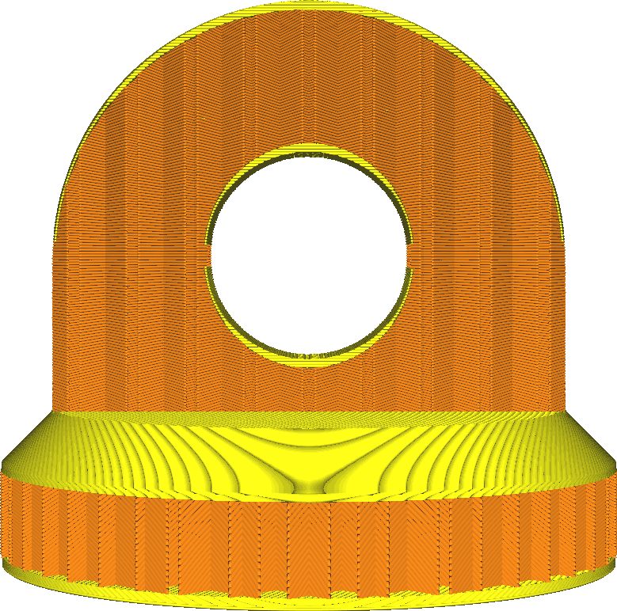

Supportvulling
====
Als deze functie is geactiveerd, wordt de vulling behandeld als support. De vulling wordt dan alleen gemaakt waar nodig om het bovenoppervlak te ondersteunen. Het gedraagt ​​zich alsof het model hol is en binnenin support creëert, maar die support wordt gecreëerd met behulp van de vulinstellingen.

* Dit bespaart veel materiaal voor de vulling met zeer weinig optisch verlies.
* De toppen kunnen iets meer doorzakken als deze functie is ingeschakeld.
* Wel kan de horizontale sterkte van de vulling afnemen. In veel gevallen zal er geen opvulling achter de wanden zijn waar de wanden deel uitmaken van een steile helling.