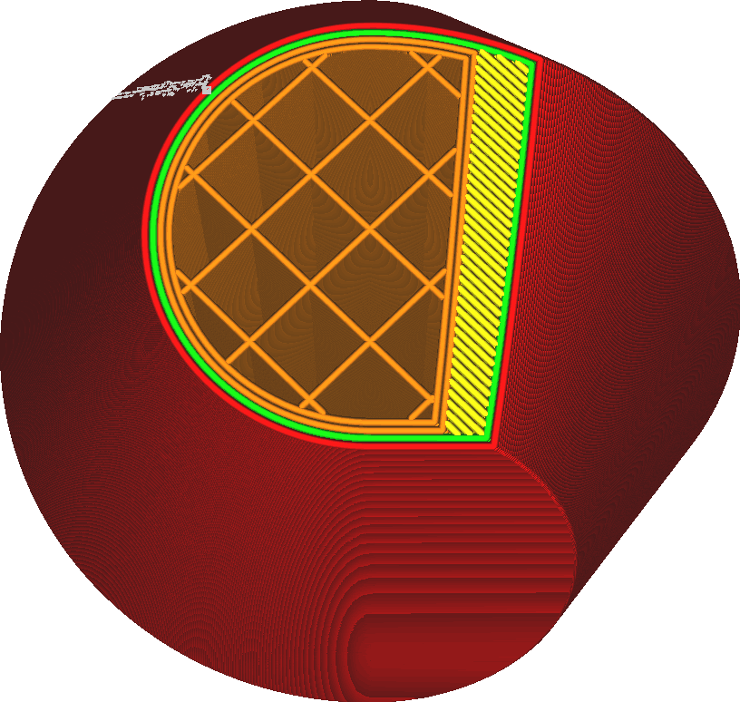

Aantal Extra Wanden Rond vulling
====
Deze instelling voegt een reeks contouren toe rond de opvulgebieden. Dit is vergelijkbaar met het verhogen van de [Aantal Wandlijnen](../shell/wall_line_count.md), maar de contouren gaan niet alleen rond de skin en de wanden, maar bevinden zich ook tussen de skin en de vulling. Het is ook vergelijkbaar met het toevoegen van [Aantal Extra Wandlijnen Rond Skin](../top_bottom/skin_outline_count.md) maar rond de vulling en niet rond de skin.

Deze wanden worden geprint met de vulling instellingen.

Vergeleken met het toevoegen van extra wanden rond de skin, verhoogt deze instelling de sterkte van het model en vermindert de zichtbaarheid van de vulling door de skin, maar verhoogt ook de printtijd en het materiaalverbruik. Hoewel extra wanden van de buitenskin materiaal vervangen dat sowieso als skin zou zijn geprint, voegt deze instelling in feite materiaal toe, tenzij de opvuldichtheid al 100% is.

Dit lijkt erg op het toevoegen van extra wanden rond de hele print. Het is echter aan te raden om minimaal één extra wand rond de invulling of skin toe te voegen om te voorkomen dat de skinlijnen in de lucht eindigen.