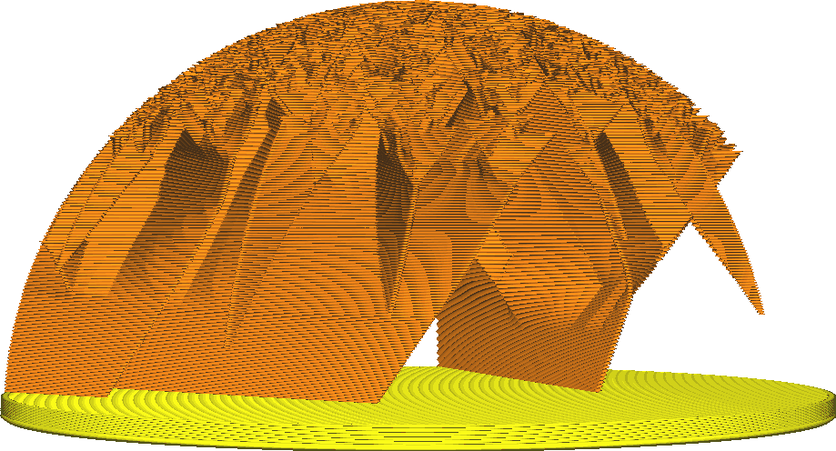

Snoeihoek bliksemvulling
====
Het Bliksemvulling-patroon creëert een boomachtige structuur aan de binnenkant van de print die klein begint maar vertakt om alle delen van de bovenkant van de print te bereiken die interne support nodig hebben. Deze instelling specificeert hoe ver de takken van de boom kunnen overhangen bij de eindpunten.

<!--screenshot {
"image_path": "lightning_infill_prune_angle_40.png",
"modellen": [{"script": "half_sphere.scad"}],
"camerapositie": [112, 15, 9],
"instellingen": {
    "infill_pattern": "bliksem",
    "wall_line_count": 0,
    "top_lagen": 0,
    "lightning_infill_support_angle": 40,
    "lightning_infill_prune_angle": 40
},
"kleuren": 32
}-->
<!--screenshot {
"image_path": "lightning_infill_prune_angle_70.png",
"modellen": [{"script": "half_sphere.scad"}],
"camerapositie": [112, 15, 9],
"instellingen": {
    "infill_pattern": "bliksem",
    "wall_line_count": 0,
    "top_lagen": 0,
    "lightning_infill_support_angle": 40,
    "lightning_infill_prune_angle": 70
},
"kleuren": 32
}-->

Door de afknothoek te vergroten, kan de vulling onderaan kleiner beginnen maar toch het hele bovenoppervlak bedekken. In veel gevallen hoeft het niet eens meer onderaan te beginnen, maar kan het direct aan de zijkanten worden bevestigd. De belangrijkste effecten van het vergroten van deze hoek zijn:

* Verminderde printtijd en materiaalverbruik.
* Gladdere wanden omdat er minder vulmateriaal de wanden van binnenuit raakt.
* Iets lagere sterkte.
* Grotere kans op printfouten. Als de overhang te steil is, zal er aan het einde van elke lijn een aanzienlijke overhang zijn die doorhangt en los kan komen.

In de praktijk kan de trimhoek groter zijn dan de normale overhanghoek of de andere overhanghoeken van de bliksemvulling. Omdat de lijnen goed worden ondersteund op de onderliggende laag, is een iets grotere overhang niet echt een probleem.