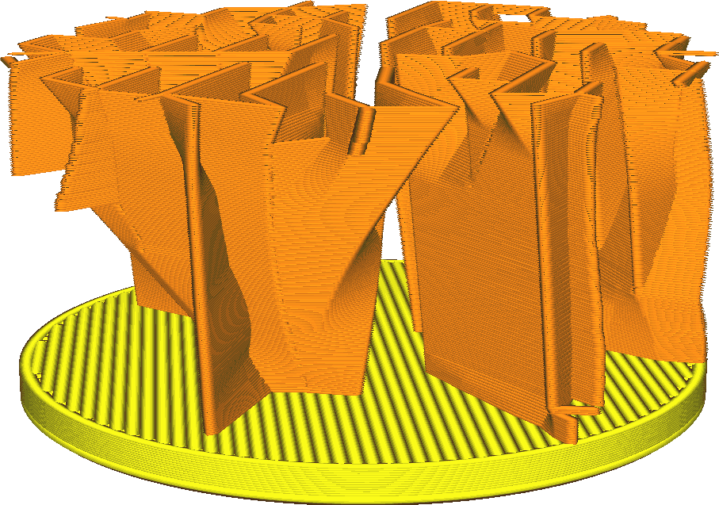
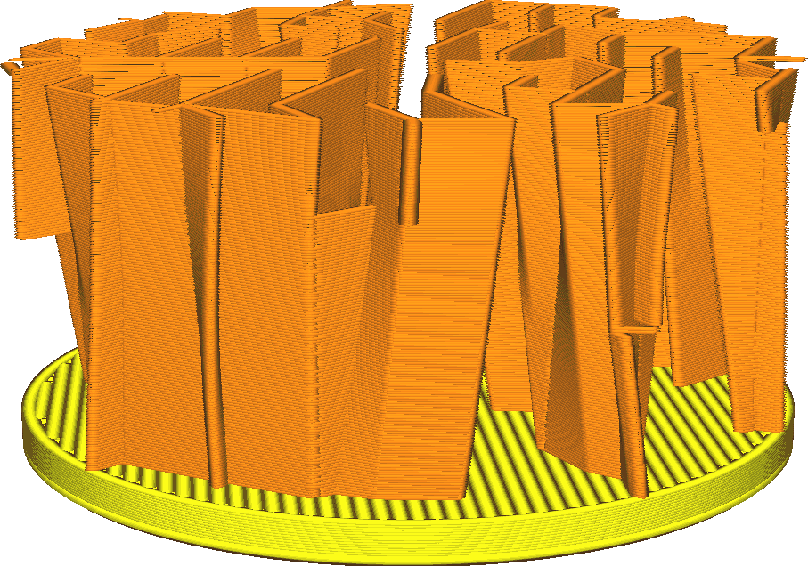

Rechtbuighoek bliksem vulling
====
Deze instelling bepaalt hoe steil het bliksempatroon naar binnen mag uitsteken.

Bliksemvulling creëert de gelijknamige bliksemachtige zigzaglijnen waar het de bovenkant van de print moet ondersupporten, maar deze nemen veel tijd in beslag vanwege de scherpe hoeken in de lijnen. Daarom proberen we hieronder deze gekartelde lijnen recht te trekken om de printtijd te verkorten. Dit rechttrekken leidt tot uitsteeksels. De instelling bepaalt hoeveel overhang is toegestaan.

<!--screenshot {
"image_path": "lightning_infill_straightening_angle_40.png",
"modellen": [
    {
        "script": "cilinder.scad",
        "transformatie": ["scaleZ(0.5)"]
    }
],
"camerapositie": [36, 44, 19],
"instellingen": {
    "infill_pattern": "bliksem",
    "wall_line_count": 0,
    "top_lagen": 0,
    "lightning_infill_support_angle": 40,
    "lightning_infill_prune_angle": 10,
    "lightning_infill_straightening_angle": 40
},
"kleuren": 32
}-->
<!--screenshot {
"image_path": "lightning_infill_straightening_angle_10.png",
"modellen": [
    {
        "script": "cilinder.scad",
        "transformatie": ["scaleZ(0.5)"]
    }
],
"camerapositie": [36, 44, 19],
"instellingen": {
    "infill_pattern": "bliksem",
    "wall_line_count": 0,
    "top_lagen": 0,
    "lightning_infill_support_angle": 40,
    "lightning_infill_prune_angle": 10,
    "lightning_infill_straightening_angle": 10
},
"kleuren": 32
}-->

Snel rechttrekken (grotere overhang) verkort de printtijd enigszins, maar vermindert ook de printbetrouwbaarheid, vooral bij dunne lijnbreedtes. Als de overhang te steil is, zal de laag splijten. De opening bevindt zich aan de binnenkant van de print en is vaak geen probleem, maar het kan ervoor zorgen dat dat deel van de vulling volledig mislukt, waardoor een deel van de bovenkant niet wordt ondersupportd. Dit wordt dan zichtbaar als een oneffen gebied of kussen aan de bovenkant, of in het slechtste geval zelfs een wirwar van gesmolten plastic.