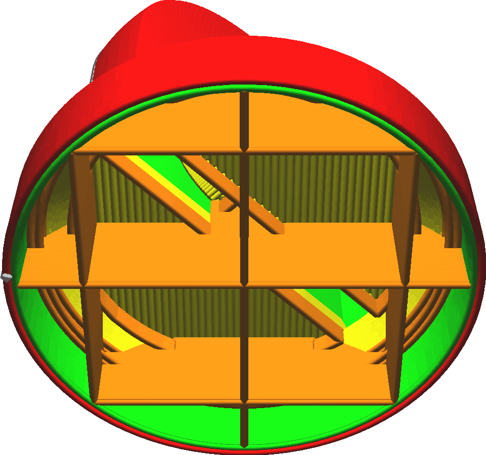

Dikte skinrandondersteuning
====
Indien concave vormen worden geprint ontstaat er een buitenskin die ergens in het midden van de vulling eindigt. Deze instelling voegt een extra lijn toe door de vulling om de rand van de skin te ondersupporten, zodat deze iets minder doorhangt.

Een enkele lijn door de openingen in de vulling zal nog steeds doorzakken, dus de lijn kan op meerdere lagen worden getrokken onder de rand van de skin die support nodig heeft. Deze instelling stelt de verticale dikte van de lijn onder de rand van de skin in. Als alternatief kunt u het [Lagen skinrandondersupporting](skin_edge_support_layers.md) direct instellen onder de rand van de skin waarop deze lijn wordt geprint.

In het algemeen heeft een verhoging de volgende effecten op de print:
* De rand van de skin wordt beter ondersteund wat resulteert in een gladder bovenoppervlak omdat de skin volledig van links naar rechts kan worden overbrugd.
* Het printproces duurt iets langer en gebruikt meer materiaal.

Als de vulsnelheid hoog is, heeft deze instelling weinig effect op het bovenoppervlak en kan [over-extrusie](../troubleshooting/overextrusion.md) in de vulling ontstaan. Het is het beste om het op 0 lagen te laten.