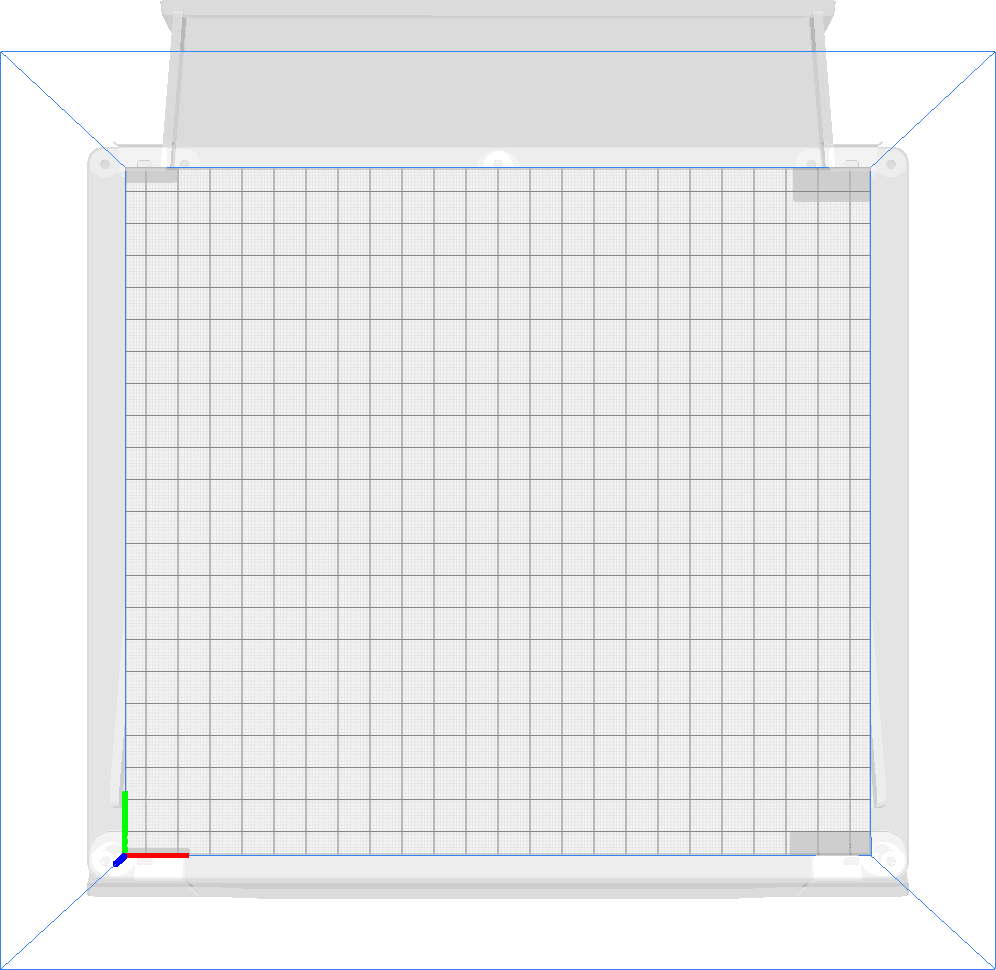

Verboden gebieden
====
Deze instelling toont alle gebieden op de platform waar de printkop niet mag printen. De gebruiker mag geen objecten in deze gebieden of zo dichtbij plaatsen dat er iets zou worden afgeprint (zoals een rand).

Deze verboden gebieden zijn nodig om te voorkomen dat de printkop ergens tegenaan botst. Er kan bijvoorbeeld een veegborstel binnen het bereik van de printkop zijn, of een bedieningspaneel, of een camera die iets te ver in het bouwvolume uitsteekt. Als de gebruiker te dicht bij deze objecten zou printen, zou de printkop ermee in botsing komen. In het beste geval treedt een [laagverschuiving](../troubleshooting/layer_shift.md) op. In het ergste geval wordt de printkop of het object waar de printkop tegenaan botst beschadigd.

De niet-toegestane gebieden worden als grijze arcering op de platform getekend om de gebruiker te waarschuwen dat er geen objecten kunnen worden geplaatst. Deze schaduwen kunnen in alle richtingen worden verlengd om te voorkomen dat de rand of het schort er tegenaan stoot, en ook om verschillende andere redenen. Er zijn ook andere schaduwen op de platform, bijvoorbeeld om het bewegingsbereik te beperken wanneer de sproeiers verschoven zijn.

Als alleen de actieve nozzle tegen het obstakel zou botsen, kan de vergelijkbare instelling [Verboden gebieden voor de nozzle](nozzle_disallowed_areas.md) voorkomen dat de nozzle in botsing komt met het obstakel, terwijl de printkop toch over het obstakel kan gaan.

**Omdat dit een machine-instelling is, is deze instelling normaal gesproken niet zichtbaar in de instellingenlijst.**