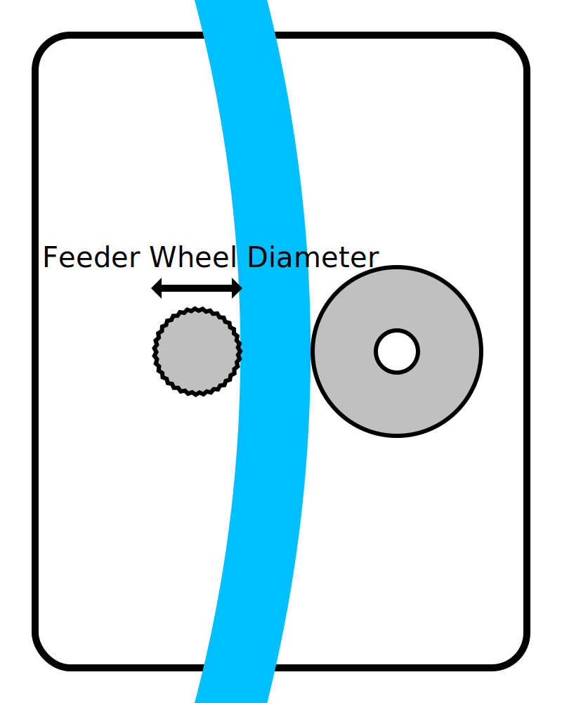

Diameter van het feedertandwiel
====
Deze instelling is een maat voor de diameter van het wiel dat het filament heen en weer beweegt in de feeder.

Deze instelling wordt door Cura helemaal niet gebruikt. Het wordt echter gebruikt door de X3GWriter-plug-in om de feed correct te beheren. Het moet weten hoe snel de feeder moet worden verplaatst om het filament op de juiste afstand te verplaatsen.

**Omdat dit een machine-instelling is, is deze instelling normaal gesproken niet zichtbaar in de instellingenlijst.**