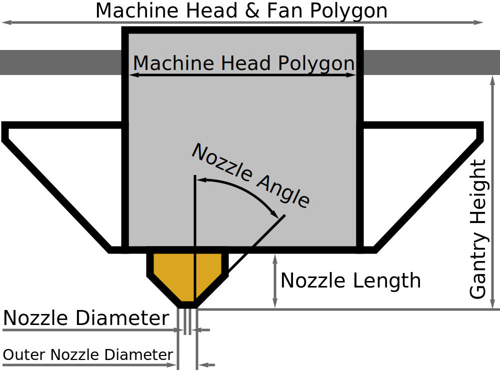

Nozzlehoek
====
Deze instelling bevat een meting van de nozzlehoek in graden. Een kleinere hoek betekent dat de punt erg scherp is. Een grotere hoek betekent dat de punt botter is.

Deze hoek wordt gebruikt om de afstand tussen aangrenzende supporten te bepalen bij gebruik van [Deaadprinten](../experimental/wireframe_enabled.md). Als nozzle erg bot is, moeten de verticale supporten zeer ver uit elkaar staan, zodat nozzle andere supporten niet raakt.

**Omdat dit een machine-instelling is, is deze instelling normaal gesproken niet zichtbaar in de instellingenlijst.**