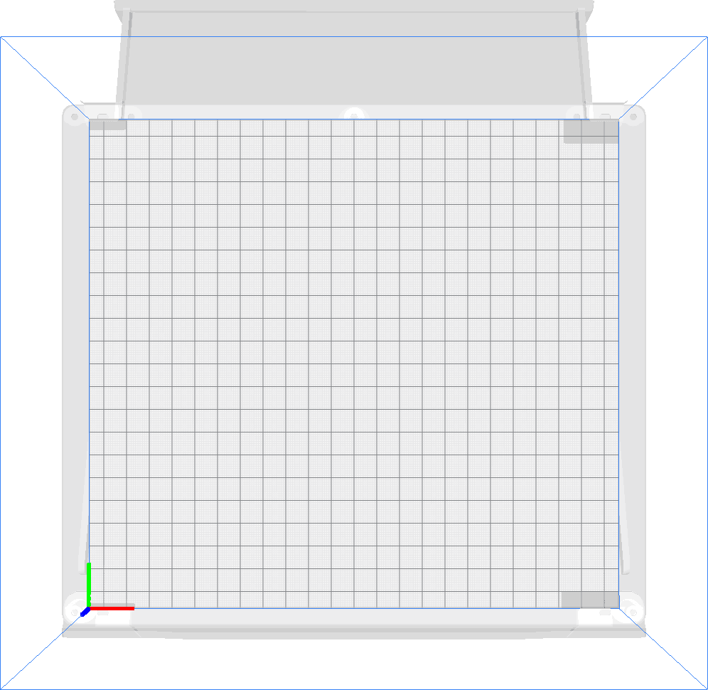

Verboden gebieden voor de nozzle
====
Deze instelling toont alle gebieden op uw platform waar het actieve nozzle niet mag komen. De gebruiker mag geen objecten in deze gebieden of zo dichtbij plaatsen dat er iets zou worden geprint (zoals een brim).

Deze instelling is alleen van toepassing op de *actieve nozzle*, wat betekent dat u nog steeds objecten naast deze verboden gebieden kunt printen, zelfs als hierdoor andere nozzles over die verboden gebieden zouden bewegen. Deze instelling is dus alleen zinvol voor printers die de inactieve nozzles omhoog brengen of deze buiten het bouwvolume parkeren wanneer ze inactief zijn. In tegenstelling tot de normale [Verboden gebieden](machine_disallowed_areas.md), worden deze verboden gebieden niet verschoven, afhankelijk van de offset tussen de nozzles.

Deze verboden gebieden zijn nodig om te voorkomen dat nozzle ergens tegenaan botst. Er kunnen bijvoorbeeld enkele clips, een sticker of een logo op de platform staan. Als de gebruiker te dicht bij deze objecten zou printen, zou de nozzle ermee in botsing komen. In het beste geval treedt een [laagverschuiving](../troubleshooting/layer_shift.md) op. In het ergste geval zou nozzle of het object waar nozzle tegenaan botst worden beschadigd.

De verboden gebieden worden als grijze gebieden op de platform geprint om de gebruiker aan te geven dat daar geen objecten kunnen worden geplaatst. Deze oppervlakken kunnen in alle richtingen worden verlengd om te voorkomen dat de brim of skirt ze raakt en om verschillende andere redenen. Er zijn ook andere schaduwen op de platform, bijvoorbeeld om het bewegingsbereik te beperken wanneer de sproeiers verschoven zijn.

**Omdat dit een machine-instelling is, is deze instelling normaal gesproken niet zichtbaar in de instellingenlijst.**