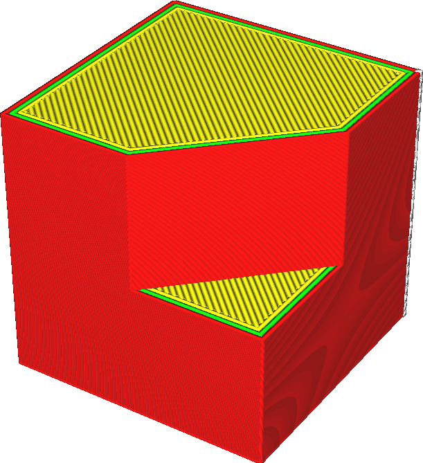

Onderbroken Oppervlakken Behouden
====
Cura moet weten waar de binnenkant van je model is om het volume met materiaal te kunnen vullen. Als het model niet goed gesloten is, dan is dit dubbelzinnig. Normaal gesproken print Cura geen onderdelen die niet goed gesloten zijn.

Als deze instelling is ingeschakeld, blijven plakjes waarvan de omtrek niet goed is gesloten, behouden. De grens is kunstmatig gesloten met een rechte lijn. Dit kan ertoe leiden dat sommige modellen met kleine openingen in hun oppervlak worden gecorrigeerd. Maar het kan ook leiden tot verkeerde interpretaties van de binnenkant van uw model.

<!--screenshot {
"image_path": "meshfix_keep_open_polygons_shell.png",
"modellen": [{"script": "cube_missing_corner.py"}],
"camerapositie": [85, -55, 75],
"laag": -1
}-->
<!--screenshot {
"image_path": "meshfix_keep_open_polygons_disabled.png",
"modellen": [{"script": "cube_missing_corner.py"}],
"camerapositie": [85, -55, 75],
"instellingen": {
    "meshfix_keep_open_polygons": false
},
"kleuren": 64
}-->
<!--screenshot {
"image_path": "meshfix_keep_open_polygons_enabled.png",
"modellen": [{"script": "cube_missing_corner.py"}],
"camerapositie": [85, -55, 75],
"instellingen": {
    "meshfix_keep_open_polygons": true
},
"kleuren": 64
}-->

In de röntgenweergave worden gaten die met deze instelling kunnen worden gedicht, in rood weergegeven.