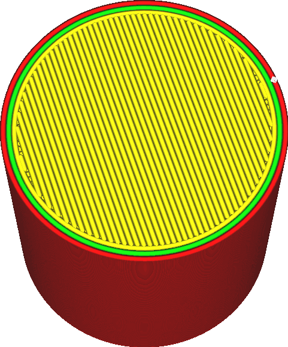

Maximale afwijking
====
Hoewel inrvoer met een hoge resolutie op het eerste gezicht misschien beter lijkt, kan de printer vaak niet goed overweg met G-code met hoge resolutie. Daarom zal Cura de resolutie van de invoer tijdens het slicen verminderen. Deze instelling bepaalt hoe ver het verkleinde pad mag afwijken van het oorspronkelijke pad om de resolutie te verlagen.

<!--screenshot {
"image_path": "meshfix_maximum_resolution_0.05.png",
"modellen": [{"script": "cilinder.scad"}],
"camerapositie": [40, -20, 116],
"instellingen": {
    "meshfix_maximum_resolution": 0.05
},
"kleuren": 64
}-->
<!--screenshot {
"image_path": "meshfix_maximum_resolution_1.png",
"modellen": [{"script": "cilinder.scad"}],
"camerapositie": [40, -20, 116],
"instellingen": {
    "meshfix_maximum_resolution": 4,
    "meshfix_maximum_deviation": 0,5
},
"kleuren": 64
}-->

De printer moet de G-code verwerken terwijl deze draait. Als de G-code veel kleine lijnsegmenten bevat, kan de printkop zo snel door de beweging racen dat de processor van de 3D-printer het niet kan bijhouden. Dit zorgt ervoor dat de printkop sporadisch vertraagt, zodat de CPU de achterstand kan inhalen of gewoon wacht op het volgende bewegingscommando. Dit zorgt ervoor dat het oppervlak erg ruw wordt of zelfs kleine klodders krijgt omdat de doorvoer van de sproeikop niet perfect overeenkomt met de sporadische beweging van de sproeier. Soms resulteert een lagere resolutie in een betere printkwaliteit.

Deze instelling geeft aan in hoeverre het nieuwe pad met lagere resolutie mag afwijken van het oorspronkelijke pad met hoge resolutie. Van lijnen wordt aangenomen dat ze verbinding maken met andere lijnsegmenten als ze korter zijn dan [Maximale resolutie](meshfix_maximum_resolution.md). Als deze reductie er echter toe zou leiden dat het pad meer afwijkt dan de afstand die door deze instelling is opgegeven, zullen de lijnen geen verbinding maken.

Houd er rekening mee dat niet gegarandeerd dezelfde hoekpunten uit elke laag worden verwijderd als de hoekpunten overeenkomen. Resolutiereductie wordt in 2D uitgevoerd door hoekpunten van de vormen van de laag te verwijderen, niet in 3D door hoekpunten van de mesh te verwijderen. Als de resolutie te veel wordt verlaagd, resulteert dit vaak in een onregelmatig oppervlak in plaats van een gekarteld oppervlak.

Vanwege structurele integriteit wordt het sterk aanbevolen dat paden niet meer dan een halve lijnbreedte afwijken. Als u echter wilt dat het oppervlak glad is of er mooi uitziet, geeft deze instelling in wezen aan hoe ernstig de onregelmatigheden op het oppervlak kunnen zijn. De maximale afwijking moet zo klein zijn dat deze niet met het blote oog te zien is.

Als u echter de maximale afwijking te veel verkleint, wordt de resolutie sterk verminderd. De resulterende g-code kan dan niet goed worden geprint vanwege het onvermogen van de CPU om de korte bewegingsopdrachten bij te houden.