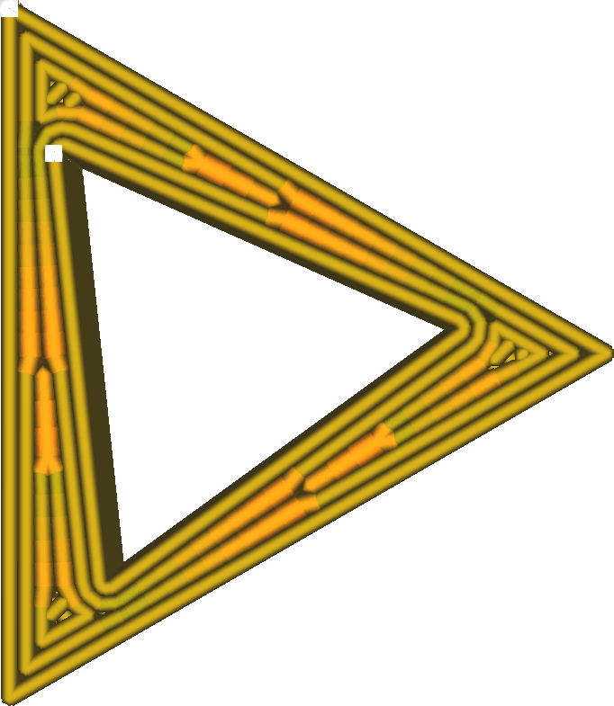

Maximale afwijking doorvoergebied
====
Wanneer u lijnen van verschillende breedten print, is het gebruikelijk dat een lijn geleidelijk dunner wordt naar een van de eindpunten toe. Deze instelling bepaalt de toename waarmee deze lijnen dunner of breder worden door te bepalen hoe dicht de lijnen moeten blijven bij het gebied dat ze idealiter zouden moeten bestrijken.

<!--screenshot {
"image_path": "meshfix_maximum_extrusion_area_deviation_high.png",
"modellen": [{"script": "twisted_triangular_hole.scad"}],
"camerapositie": [0, 0, 60],
"instellingen": {
	"meshfix_maximum_resolution": 0,5,
	"meshfix_maximum_extrusion_area_deviation": 2000
},
"color_scheme": "line_width",
"kleuren": 128
}-->
<!--screenshot {
"image_path": "meshfix_maximum_extrusion_area_deviation_low.png",
"modellen": [{"script": "twisted_triangular_hole.scad"}],
"camerapositie": [0, 0, 60],
"instellingen": {
	"meshfix_maximum_resolution": 0,05,
	"meshfix_maximum_extrusion_area_deviation": 20
},
"color_scheme": "line_width",
"kleuren": 128
}-->

G-code-opdrachten kunnen de printer niet vertellen om een ​​regel met variabele breedte printen. Het moet lijnen met een vaste breedte printen. Cura kan een lijn opsplitsen in meerdere segmenten van geleidelijk veranderende breedte. Dit voegt echter veel lijnsegmenten toe bij het printen. De CPU van de printer kan tijdens het printen mogelijk niet al deze instructies verwerken. Deze instelling kiest het detailniveau van de lijnsegmenten met variabele breedte. Een hogere resolutie (lagere afwijking) resulteert in theorie in nauwkeurigere lijnen, maar verhoogt ook aanzienlijk het aantal instructies.

Hoewel het er mooi uitziet in laagweergave wanneer de breedte van een lijn geleidelijk verandert, heeft het vrijwel geen effect op de daadwerkelijke print. Fysieke 3D-printers passen hun doorvoer niet precies genoeg aan om een ​​verbetering te zien wanneer de resolutie hier wordt verhoogd. Onder normale omstandigheden moet deze instelling zo hoog worden ingesteld dat het nooit een beperkende factor is in de resolutie van de G-code. Dit minimaliseert het risico op een buffer-underrun.