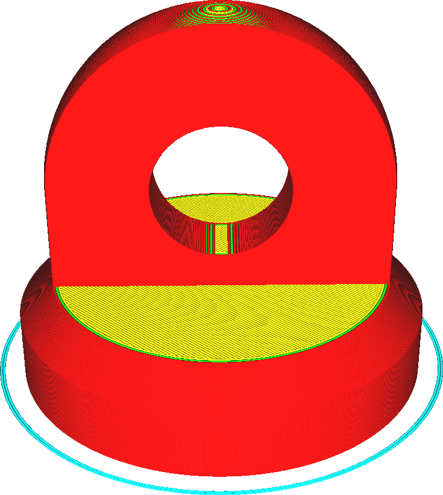
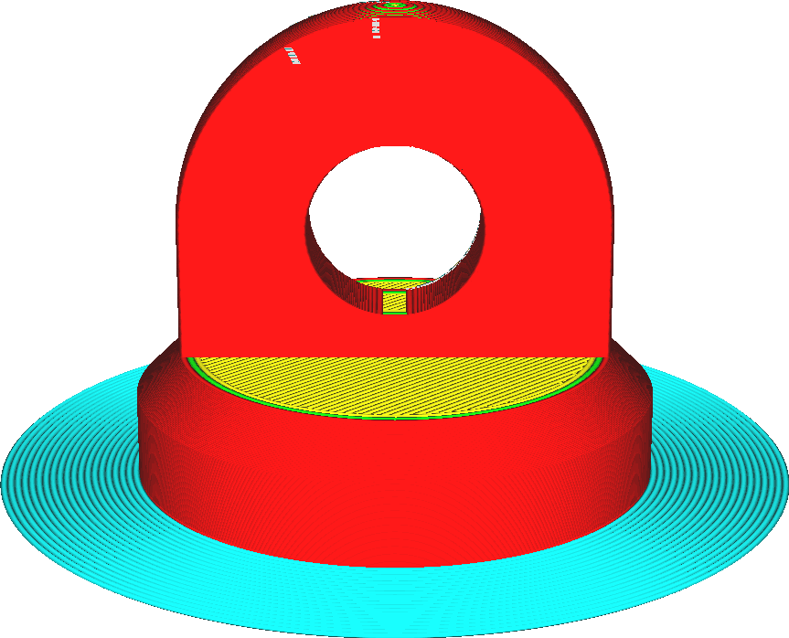
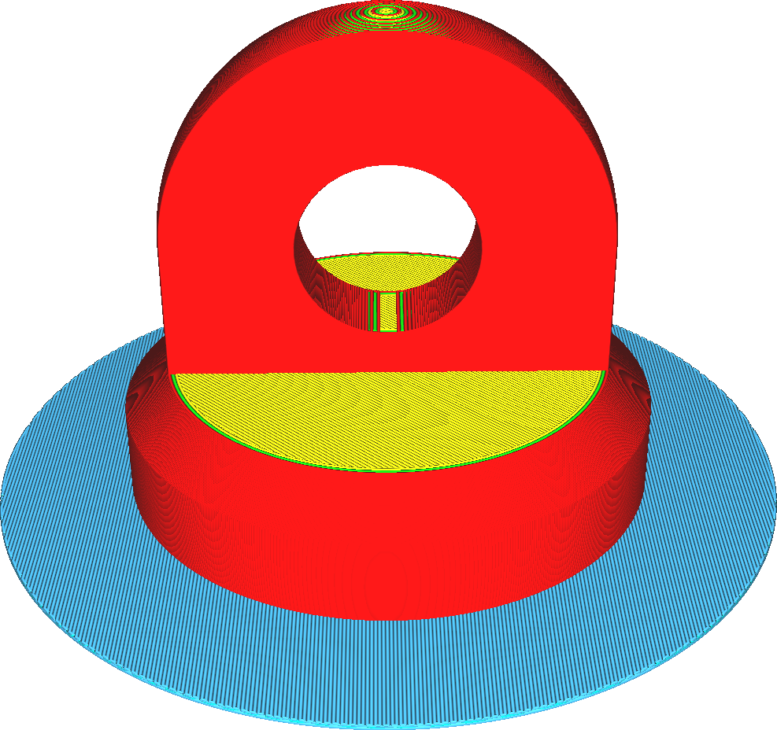

Type Hechting aan Platform
====
Er zijn drie soorten hechting van platformen: skirt, brim en raft. U kunt de soorten hechting ook eenvoudig uitschakelen door deze op "Geen" te zetten.

<!--screenshot {
"image_path": "adhesion_type_skirt.png",
"modellen": [
    {
        "script": "stempel.scad",
        "transformatie": ["schaal(0.5)"]
    }
],
"camerapositie": [0, 128, 53],
"settings": {"adhesion_type": "skirt"},
"kleuren": 64
}-->
<!--screenshot {
"image_path": "adhesion_type_brim.png",
"modellen": [
    {
        "script": "stempel.scad",
        "transformatie": ["schaal(0.5)"]
    }
],
"camerapositie": [0, 128, 53],
"settings": {"adhesion_type": "brim"},
"kleuren": 64
}-->
<!--screenshot {
"image_path": "adhesion_type_raft.png",
"modellen": [
    {
        "script": "stempel.scad",
        "transformatie": ["schaal(0.5)"]
    }
],
"camerapositie": [0, 128, 53],
"settings": {"adhesion_type": "raft"},
"kleuren": 64
}-->

Skirt
----
Een skirt is een enkele lijn die je print omringt. Het draagt niet direct bij aan een betere plaathechting. Als u de andere methoden echter niet wilt gebruiken, heeft deze methode twee functies.
* Het zorgt ervoor dat uw nozzle wordt gevuld voordat uw werkelijke model wordt geprint om ervoor te zorgen dat het materiaal goed stroomt.
* Hiermee kunt u zien of uw platform goed is geleveld.

Brim
----
Een brim is een vlak gebied met één laag rond de basis van uw model. Het doel is om de randen van uw print omlaag te houden en het contactgebied tussen uw print en de platform te vergroten.
* Door het grotere oppervlak hecht de print beter aan de platform. Dit is handig voor vrijwel elke print die groter is dan enkele centimeters.
* Deze brim houdt ook de randen van de print naar beneden. Materialen die veel krimpen bij afkoeling (zoals ABS) hebben de neiging om veel krom te trekken wanneer ze worden geprint. Een voldoende brede brim kan de hoeken op hun plaats houden en deze vervorming voorkomen.

Raft
----
Een raft is een dikke plaat tussen het model en het platform. Deze raft beschermt je print tegen de hitte van het platform. Het heeft ook een groot oppervlak om aan het bord te hechten. De voetafdruk wordt bovenop deze raft geplaatst, waar het veel beter kan hechten. Pas echter op voor dunne prints, want het kan moeilijk zijn om het raft te verwijderen zonder de print te beschadigen.