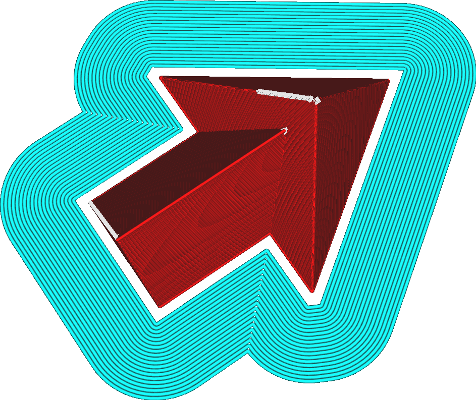

Brimafstand
====
Deze instelling creëert een opening tussen het model en de brim. De brimlijnen zitten niet meer strak om het model.

<!--screenshot {
"image_path": "brim_gap.png",
"modellen": [
    {
        "script": "pijl.scad",
        "transformatie": ["schaal(0.5)"]
    }
],
"camerapositie": [-22, 32, 133],
"instellingen": {
    "adhesion_type": "brim",
    "brim_gap": 1
},
"kleuren": 32
}-->

Deze opening moet het gemakkelijker maken om de brim van het model te trekken. Door de brimlijnen iets weg te bewegen van het eigenlijke model (in de orde van een halve lijnbreedte), wordt de verbinding tussen de brim en het model zwakker dan één laag, waardoor het gemakkelijker wordt om de brim met de hand te scheuren. Het vermindert ook het litteken of de olifantenpoot die de brim achterlaat na verwijdering. Dit is vooral effectief bij een grotere [Hoogte Eerste Laag](../resolution/layer_height_0.md) omdat de dikke brim dan moeilijker te verwijderen is.

Aan de andere kant vermindert dit ook de effectiviteit van de brim om het model op de platvorm te houden. Met een dunner contactoppervlak kan de brim geen grote kracht op het model uitoefenen om het tegen de effecten van [Kromtrekken](../troubleshooting/warping.md) te houden.