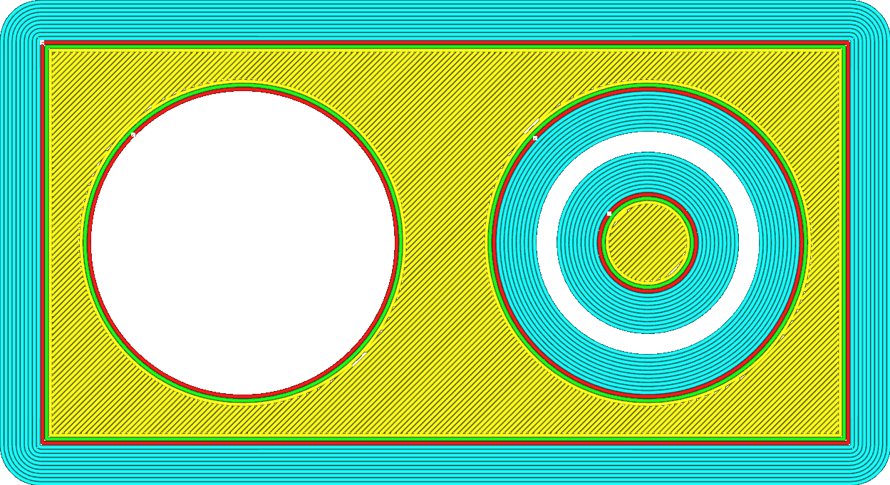

Brim Alleen aan Buitenkant
====
Als uw model gaten heeft in de eerste laag op de platvorm, voorkomt deze instelling dat er een brim aan de binnenkant van het gat wordt geprint.

<!--screenshot {
"image_path": "brim_outside_only_original.png",
"modellen": [{"script": "holes_in_panel.scad"}],
"camera_positie": [0, 0, 180],
"instellingen": {
    "adhesion_type": "brim",
    "brim_line_count": 10,
    "brim_outside_only": false
},
"laag": 1,
"kleuren": 32
}-->
<!--screenshot {
"image_path": "brim_outside_only_enabled.png",
"modellen": [{"script": "holes_in_panel.scad"}],
"camera_positie": [0, 0, 180],
"instellingen": {
    "adhesion_type": "brim",
    "brim_line_count": 10,
    "brim_outside_only": true
},
"laag": 1,
"kleuren": 32
}-->

De brim aan de binnenkant voegt meestal weinig extra hechting toe tussen de print en de platvorm en heeft geen effect op het voorkomen van krimp. Het verwijderen van de brim aan de binnenkant kan je wat tijd besparen na het printen omdat je de brim niet uit de binnenste gaten hoeft te halen.

**Als er een ander object in het gat zit, kan de brim om technische redenen niet worden verwijderd.**