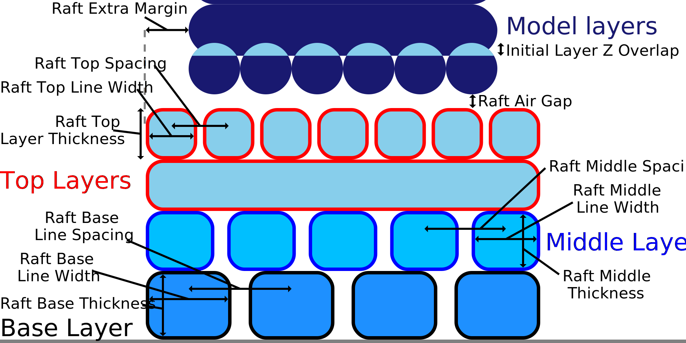

Dikte Bovenkant Raft
====
Deze instelling past de dikte van de oppervlaktelagen aan. Dit is slechts de hoogte van één laag, dus de totale hoogte van de oppervlaktelagen is gelijk aan deze instelling vermenigvuldigd met de waarde van de [Bovenlagen Raft](raft_surface_layers.md) instelling.

Een lage laaghoogte heeft de neiging om het effect van koeling op het raft te verbeteren. Dit verbetert de overhang en daarmee de gladheid van het raft. Een gladder raft betekent dat de druk erop ook soepeler is en de hechting tussen het raft en het object wordt verbeterd. Een te vlakke laag leidt echter tot onder-extrusie, wat nadelig is voor de hechting. Houd er ook rekening mee dat de doorvoer veel verandert tussen de bovenste laag van het raft en de onderste laag van het object, wat resulteert in enige onder-extrusie bij het printen van de eerste laag van het object.