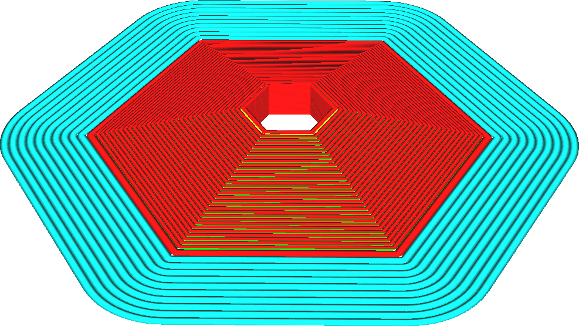

Lijnbreedte eerste laag
====
Hierdoor worden de lijnen van de eerste laag in een bepaalde verhouding breder of smaller.

<!--screenshot {
"image_path": "initial_layer_line_width_factor.png",
"modellen": [{"script": "hex_foot.scad"}],
"camerapositie": [0, 92, 122],
"instellingen": {
    "adhesion_type": "rand",
    "initial_layer_line_width_factor": 200
},
"kleuren": 32
}-->

Het doel van deze instelling is om de hechting aan de platvorm te verbeteren. Om bredere lijnen te printen, moet de nozzle meer materiaal extruderen, en dat materiaal moet verder naar buiten stromen. Hierdoor duwt de nozzle het materiaal harder op de platvorm, waardoor de hechting tussen het filament en de platvorm toeneemt.
* De lijnen worden niet alleen breder of smaller, maar met dezelfde factor ook verder uit elkaar of dichter bij elkaar, zodat er geen sprake is van over- of onder-extrusie.
* Deze instelling is van invloed op alle lijndiktes: skin, wanden, hechting, draagstructuur, primepijler, enzovoort. Ze worden in dezelfde verhouding breder of smaller gemaakt.