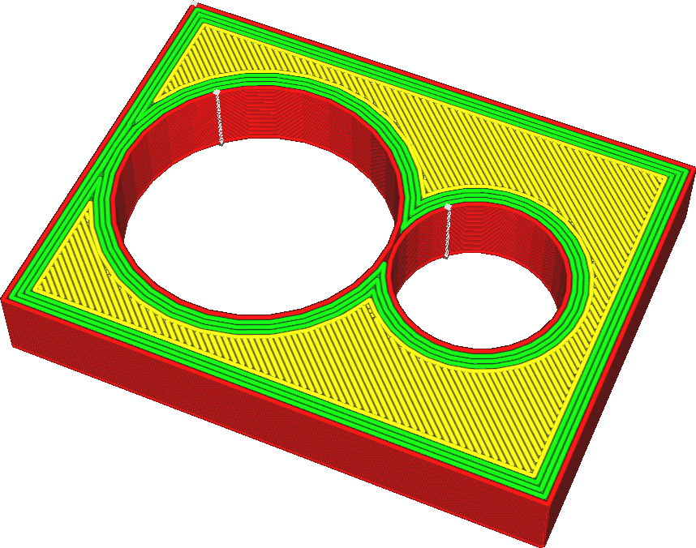

Lijnbreedte
====
Dit is de horizontale breedte van de lijnen die de printer print. Gewoonlijk bepaalt de diameter van de nozzleopening hoe breed uw lijnen zullen zijn, maar door meer of minder materiaal te extruderen, kan de printer een beetje variëren met hoe breed de lijnen zullen zijn.

<!--screenshot {
"image_path": "line_width_small.png",
"modellen": [{"script": "holes_cutout.scad"}],
"camerapositie": [17, 39, 61],
"instellingen": {"line_width": 0.2},
"kleuren": 64
}-->
<!--screenshot {
"image_path": "line_width_large.png",
"modellen": [{"script": "holes_cutout.scad"}],
"camerapositie": [17, 39, 61],
"instellingen": {"line_width": 0.6},
"kleuren": 32
}-->

Door de lijnbreedte te verkleinen, kan de printer meer details printen. In het bijzonder stelt het de printer ook in staat om dunne delen te printen. Lijndikte is een van de meest invloedrijke instellingen voor uw print. Hier zijn enkele van de effecten:
* Als u dunnere lijnen print, kunnen dunnere delen worden geprint omdat een lijn op de dunste plekken past.
* Door de lijnbreedte aan te passen aan een even veelvoud van de dikte van je print kan het object dikker worden en het materiaal beter vloeien.
* Een kleinere lijndikte zorgt ervoor dat het oppervlak er gladder uitziet.
* Printlijnen die iets kleiner zijn dan de grootte van de nozzle verbetert de sterkte. Hierdoor kan het nozzle aangrenzende lijnen samenvoegen terwijl het een tweede passage iets over de vorige lijn maakt.
* Er treedt onder-extrusie op als u te brede lijnen print. De printer probeert meer materiaal te extruderen om de gewenste breedte van de lijn te vullen. Het materiaal zal in alle mogelijke richtingen proberen te stromen. Op een gegeven moment wordt de tegendruk echter te groot waardoor het materiaal niet meer naar de rand van de zeer brede lijnen kan stromen. Hierdoor ontstaan er gaten tussen de lijnen.
* Te kleine drukleidingen leiden ook tot onder-extrusie. Als het materiaal niet snel genoeg door het nozzle stroomt, zal de oppervlaktespanning van het materiaal ervoor zorgen dat het coaguleert in kleine druppeltjes, waardoor ongelijkmatige extrusie ontstaat en openingen tussen de druppeltjes ontstaan.
* Het printen van dunnere lijnen verlengt de printtijd aanzienlijk.

**Het is niet aan te raden om de lijnbreedte te wijzigen onder 60% van de nozzlemaat of boven 150%. In beide gevallen kan er niet genoeg materiaal worden geëxtrudeerd.**

De lijnbreedtes aanpassen voor voldoende wanddiktes
----
Bij het printen van mechanische objecten die dun maar sterk moeten zijn, is een regelmatig probleem dat het onderdeel niet schoon is, zelfs niet een veelvoud van de lijnbreedte. Normaal gesproken, als het geen even veelvoud is, zal Cura de doorvoer van sommige lijnen verminderen vanwege de instelling [Overlappende wanden compenseren](../shell/travel_compensate_overlapping_walls_enabled.md). Hierdoor verandert de doorvoersnelheid door het nozzle, wat nadelig is voor de visuele kwaliteit. Als het een even veelvoud van de lijnbreedte is, maar geen even getal, wordt een van de wanden teruggebracht tot 0.

Door strakke omtrekken met gelijkmatige lijnen te maken, kan de print er sterker en beter uitzien. De mogelijkheid om de lijnbreedte aan te passen zodat het gewenste aantal contouren de print vult, is een kenmerk van een doorgewinterde Cura-gebruiker.

<!--screenshot {
"image_path": "line_width_fit_bad.png",
"modellen": [{"script": "paper_stand.scad"}],
"camerapositie": [-128, 46, 73],
"camera_lookat": [-120, 38, 0],
"instellingen": {
    "wall_line_count": 99,
    "line_width": 0.46
},
"laag": 161,
"kleuren": 64
}-->
<!--screenshot {
"image_path": "line_width_fit_good_small.png",
"modellen": [{"script": "paper_stand.scad"}],
"camerapositie": [-128, 46, 73],
"camera_lookat": [-120, 38, 0],
"instellingen": {
    "wall_line_count": 99,
    "line_width": 0.258
},
"laag": 161,
"kleuren": 32
}-->
<!--screenshot {
"image_path": "line_width_fit_good_large.png",
"modellen": [{"script": "paper_stand.scad"}],
"camerapositie": [-128, 46, 73],
"camera_lookat": [-120, 38, 0],
"instellingen": {
    "wall_line_count": 99,
    "line_width": 0,515
},
"laag": 161,
"kleuren": 64
}-->

Houd de doorvoer constant
----
Grote fluctuaties in de doorvoer zijn soms problematisch voor FDM-printers. De nozzlekamer houdt een deel van het materiaal onder druk, wat de werkelijke doorvoersnelheid uit het nozzle vertraagt. Het duurt even voordat de doorvoer stijgt of daalt. Bij printers met een Bowden-systeem voor het voeden van het filament is ook de Bowden-slang veerkrachtig, waardoor het effect nog verder wordt vergroot. Als gevolg hiervan zal overschakelen naar een hogere doorvoer resulteren in over-extrusie en zal het overschakelen naar een lagere doorvoer resulteren in onder-extrusie. Het is daarom raadzaam om het doorvoer zo constant mogelijk te houden.

Lijnbreedte heeft een grote invloed op de doorvoersnelheid. Het is raadzaam om de breedte van de lijnen dicht bij elkaar te houden en dicht bij de maat van de nozzle. Als u de lijnbreedte aanzienlijk wijzigt, kunt u ook de printsnelheid aanpassen om de doorvoersnelheid constanter te houden. Dit verbetert de maatnauwkeurigheid van de print.