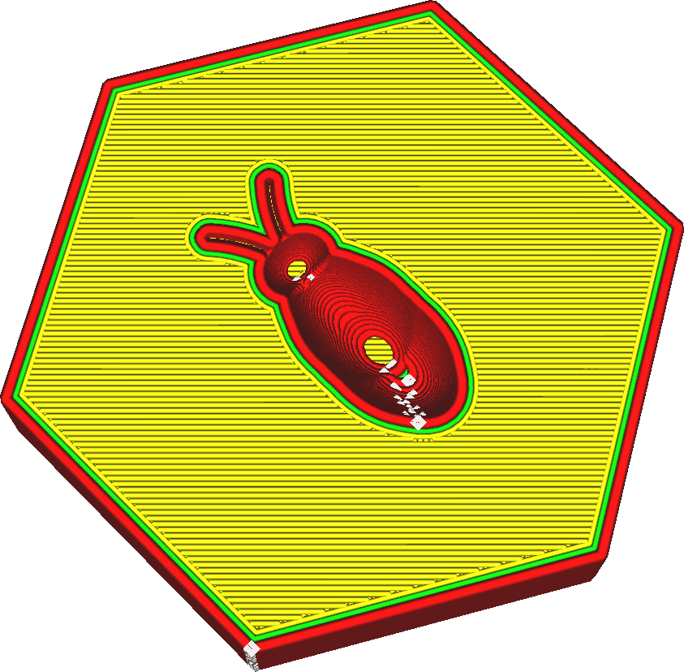

Lijnbreedte Buitenwand
====
De breedte van de buitenwandlijnen kan afzonderlijk van de binnenwandlijnen worden ingesteld. Deze instelling specificeert hoe breed de buitenwandlijn zal zijn.

<!--screenshot {
"image_path": "wall_line_width_0.png",
"modellen": [{"script": "hive.scad"}],
"camerapositie": [-31, -31, 147],
"instellingen": {
    "wall_line_count": 2,
    "wall_line_width_0": 0,8
},
"kleuren": 64
}-->

Het is bekend dat het verminderen van de lijnbreedte van de buitenwand net onder de maat van het nozzle gunstig is voor de sterkte. Het nozzle zal iets minder materiaal extruderen, maar de opening zal overlappen met de aangrenzende wandlijnen. Hierdoor wordt het materiaal vanaf de eerder geplaatste wand naar de gewenste plek geduwd. Dit betekent echter ook dat het plastic beter versmelt met de aangrenzende wanden. Hierdoor kunnen de wanden beter samensmelten, waardoor ze hun kracht kunnen bundelen. Dit verbetert de sterkte van de wanden aanzienlijk.

Door de breedte van de buitenwandlijn te verkleinen, kan het nozzle ook fijnere details printen, omdat de dunnere lijn beter opgaat in kleine details.

Het vergroten van de breedte van de buitenwandlijnen kan de printtijd verkorten. Met minder binnenwanden kunt u een wand van vergelijkbare dikte realiseren. De sterkte neemt echter wat af omdat de buitenwanden niet zo goed versmelten met de binnenwanden.

Lijnen laten passen
----
Bij het printen van dunne objecten is het aanpassen van de wandlijnbreedte een belangrijk hulpmiddel om nauwkeurige en stabiele modellen te krijgen. Cura tekent alleen volledige omtrekken, dus als een omtrek niet past, ontstaat er een opening in de wanden, wat de sterkte en nauwkeurigheid van het object ernstig beïnvloedt.

Cura zal proberen om dergelijke gaten tussen wanden op te vullen als [Opvulruimte tussen wanden](../shell/fill_perimeter_gaps.md) is ingeschakeld, maar deze techniek is niet ideaal voor elke vorm en het printen duurt vaak lang. Wanneer twee wanden elkaar overlappen, vermindert de functie [Gelijmatige wandoverlappingen](../shell/travel_compensate_overlapping_walls_enabled.md) de breedte van de wandlijnen om ervoor te zorgen dat het onderdeel maatvast is, maar dit introduceert stromingsveranderingen die ook de kwaliteit beïnvloeden en de sterkte van de print.

Voor een ideale pasvorm moet het onderdeel een exact veelvoud zijn van de breedte van de wandlijn, zodat de wanden precies in het onderdeel passen. Als u weet hoe breed uw onderdeel is, kunt u dit eenvoudig bereiken door de wandbreedte aan te passen. Eerst kijk je hoeveel contouren je wilt passen zodat de lijnen nog een redelijke breedte hebben. Vervolgens kunt u bepalen hoeveel u de breedte van de wandlijnen moet aanpassen om de lijnen goed te laten passen. Onthoud dat u de [Breedte van buitenwandlijnen](wall_line_width_0.md) en [Breedte van binnenwandlijnen](wall_line_width_x.md) afzonderlijk kunt instellen. Tel zorgvuldig het aantal keren dat elk type wand is geprint om de effecten van het veranderen van de lijndikte van de wand te voorspellen.

Het matchen van wandlijnen is een belangrijke 3D-printvaardigheid die ervaren 3D-printergebruikers onderscheidt. Het vergt wat oefening.