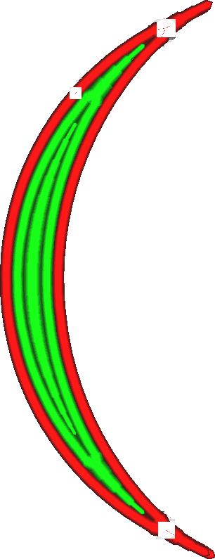

Minimum breedte ongelijkmatige wand
====
Bij het printen van dunne delen past Cura de breedte van de wandlijnen aan de exacte breedte van het model aan. Cura kan er ook voor kiezen om in plaats daarvan minder wandlijnen te gebruiken. Deze instelling is de drempel waarbij Cura een lijn in het midden verwijdert. Het kan afzonderlijk worden ingesteld met de [Minimum lijnbreedte even wand](min_even_wall_line_width.md).

<!--screenshot {
"image_path": "min_wall_line_width_0_34.png",
"modellen": [{"script": "moon_sickle.scad"}],
"camera_positie": [0, 0, 63],
"instellingen": {
	"min_wall_line_width": 0,34,
	"wall_line_count": 3,
	"wall_transition_angle": 20
},
"laag": 14,
"kleuren": 32
}-->
<!--screenshot {
"image_path": "min_wall_line_width_odd_0_1.png",
"modellen": [{"script": "moon_sickle.scad"}],
"camera_positie": [0, 0, 63],
"instellingen": {
	"min_odd_wall_line_width": 0.1,
	"min_wall_line_width": 0,34,
	"wall_line_count": 3,
	"wall_transition_angle": 20
},
"laag": 14,
"kleuren": 32
}-->

Even versus oneven lijnen
----
Deze instelling kan worden gebruikt om de drempel voor het verwijderen van lijnen specifiek voor een oneven aantal lijnen aan te passen. Dit is wanneer er een enkele regel in het midden is in plaats van twee. Het bepaalt wanneer die enkele lijn wordt verwijderd, zodat de twee lijnen eromheen iets breder zijn.

De minimale breedte van de oneven wandlijnen kan verschillen van de minimale breedte van de rechte lijnen omdat ze in elkaar overlopen. Als een oneven lijn wordt verwijderd, stopt deze voor de overgang en brengt de omringende wanden dichterbij. Er is een klein gaatje tijdens de overgang waar de omringende lijnen nog niet helemaal bij elkaar komen. Dit is anders dan een even aantal wanden: de twee lijnen in het midden vallen dan samen en overlappen elkaar enigszins. Door de minimale breedte van de oneven wandlijnen te verkleinen, wordt de opening bij de oneven-naar-even lijnovergangen kleiner. Door de minimale breedte van de even wandlijnen te verkleinen, wordt de overlap bij de even-naar-oneven lijnovergangen kleiner.

De openingen aan het einde van een oneven lijn zijn beter zichtbaar in het eindresultaat dan een kleine overschrijding op een kruising, dus het kan helpen om de minimale breedte voor oneven wandlijnen iets lager in te stellen dan de minimale breedte voor even wandlijnen.

Het verlagen van deze instelling resulteert in:
* Kleine openingen wanneer een middenlijn eindigt.
* Verminderde maximale breedte van een paar even hartlijnen.
* Dunnere lijnen die mogelijk niet goed extruderen.
* Langere regels die langer duren om printen.

**Deze instelling is niet alleen van toepassing op normale wanden, maar ook op wanden met extra skinen, supportwanden, vullingen en concentrische patronen.**