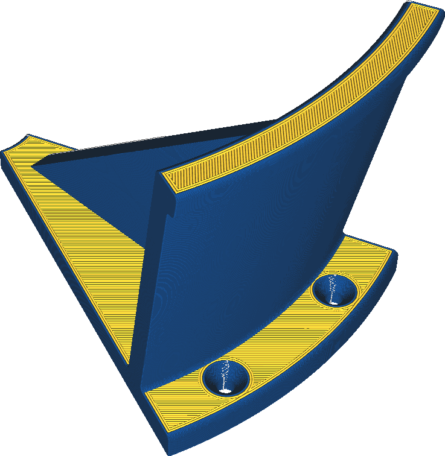

Extruder buitenwand
====
Als uw printer meerdere extruders heeft, kunt u ook alleen de buitenwand printen met een andere extruder.

<!--screenshot {
"image_path": "wall_0_extruder_nr.png",
"modellen": [{"script": "headphone_hook.scad"}],
"camerapositie": [140, 140, 206],
"instellingen": {"wall_0_extruder_nr": 1},
"color_scheme": "materiaal_kleur",
"kleuren": 32
}-->

Het printen van de buitenwand met een andere extruder kan verschillende doelen dienen:
* Even een optisch effect door de buitenwand in een andere kleur te printen.
* De buitenwand kan worden geprint met een materiaal dat meer details geeft, maar ongewenste sterkte-eigenschappen heeft voor de vulling.
* De buitenwand kan worden geprint met een flexibel materiaal om een ​​zachtere textuur op de print en meer wrijving/grip te geven.
* De buitenwand kan worden geprint met een materiaal met een lagere wrijvingscoëfficiënt, zodat bewegende delen gemakkelijker over het oppervlak kunnen schuiven.

**Eén wand is meestal niet genoeg om een ​​grote kleurverandering volledig te dekken. Verwacht dat er wat binnenwandverf doorschijnt.**