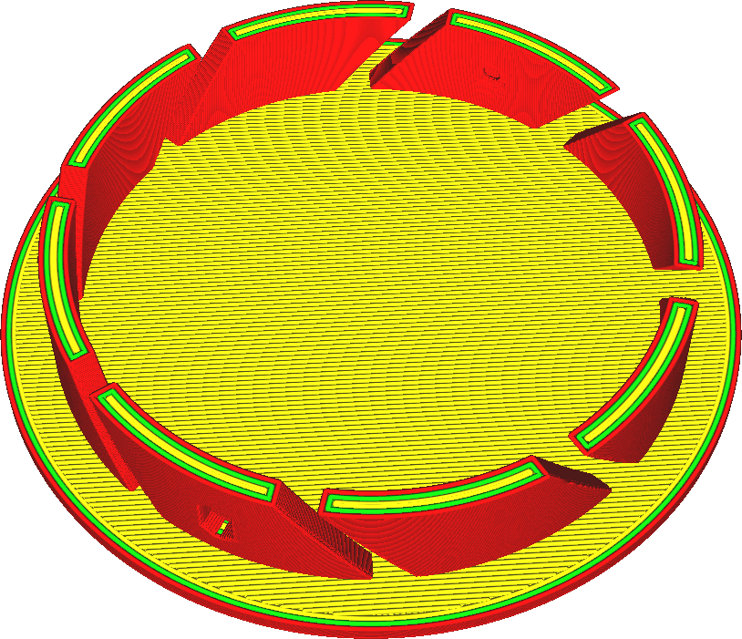
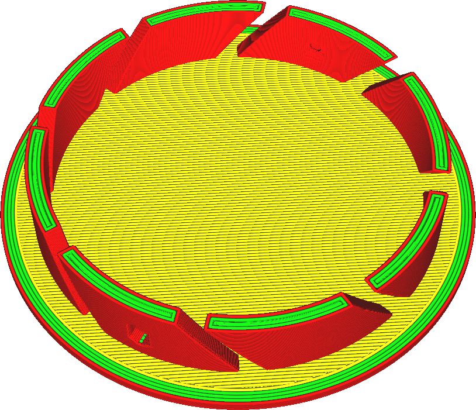

Aantal wandlijnen
====
Deze instelling bepaalt hoeveel contouren er in elke laag rond de print moeten worden gemaakt.

<!--screenshot {
"image_path": "wall_thickness_0.8.png",
"modellen": [
    {
        "script": "rotary_tumbler_lid.scad",
        "transformatie": ["schaal(0.4)"]
    }
],
"camerapositie": [50, 50, 124],
"instellingen": {
    "skin_outline_count": 0,
    "wall_line_count": 2
},
"kleuren": 32
}-->
<!--screenshot {
"image_path": "wall_thickness_1.6.png",
"modellen": [
    {
        "script": "rotary_tumbler_lid.scad",
        "transformatie": ["schaal(0.4)"]
    }
],
"camerapositie": [50, 50, 124],
"instellingen": {
    "skin_outline_count": 0,
    "wall_line_count": 4
},
"kleuren": 32
}-->

Slechts één van de wanden is een buitenwand en wordt geprint met de instellingen voor de buitenwand. De overige wanden worden geprint met de instellingen voor de binnenwanden.

Het aantal wanden is een belangrijke factor in hoe sterk de print zal zijn. Doordat de wanden naast elkaar staan, kunnen ze elkaar versterken, wat resulteert in een sterker onderdeel. Voor grotere printen kan dit, afhankelijk van de vorm, een veel effectievere manier zijn om een ​​sterk object te krijgen dan de vulling aan te passen.

Het aantal wanden vergroten wordt:
* De sterkte van de print wordt aanzienlijk vergroot.
* Verminderde doorschijning waar het vulpatroon van buitenaf zichtbaar is.
* Verbeterde overhangen omdat wandlijnen meestal meer uitgelijnd zijn met het dichtstbijzijnde supportpunt.
* Maak het model gemakkelijker waterdicht.
* Aanzienlijke toename van printtijd en materiaalverbruik van de print.