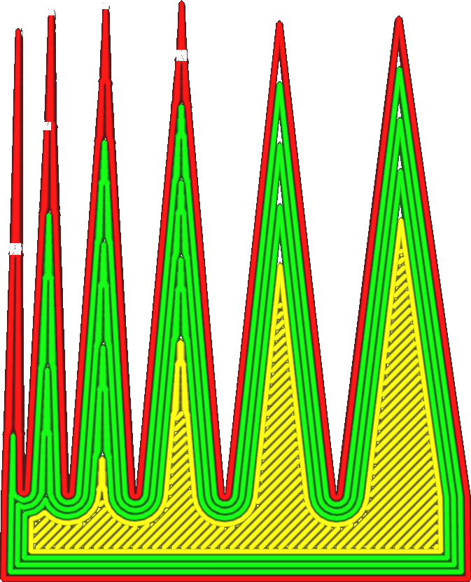

Drempelhoek wandovergang
====
Deze hoek specificeert de hoek waaronder Cura overgangen gaat maken om de ruimte goed te vullen. Alle hoeken die scherper zijn dan deze hoek worden gevuld met lijnen van variabele breedte.

<!--screenshot {
"image_path": "wall_transition_angle.png",
"modellen": [{"script": "sharpening_corners.scad"}],
"camerapositie": [0, 11, 106],
"instellingen": {
	"wall_transition_angle": 11,
	"wall_line_count": 4
},
"kleuren": 64
}-->

Hiermee worden variabele lijndiktes in- of uitgeschakeld voor specifieke hoeken. Als twee tegenover elkaar liggende wanden bijna evenwijdig zijn, dat wil zeggen kleiner dan de hoek die in deze instelling is opgegeven, wordt het gebied ertussen gevuld met lijnen die in breedte kunnen variëren. Als ze een grotere hoek met elkaar maken, wordt de ruimte ertussen gevuld met wanden van constante breedte.

Zoals altijd is dit een compromis. Het gebruik van een variabele breedte heeft enkele voordelen, zoals:
* Er zijn geen gaten meer tussen de regels.
* Vul dezelfde ruimte niet meer dan één keer in.
* De afmetingen van de print zijn dan nauwkeuriger.

Het heeft echter ook enkele nadelen:
* Hoeken verschijnen in dunne delen, die kunnen verschijnen als rimpels op het oppervlak.
* Er zijn extra rijbewegingen.
* De printer kan de lijnbreedte niet snel achter elkaar nauwkeurig wijzigen.

In de praktijk is het goed om deze hoek groot genoeg te kiezen om de openingen in scherpe hoeken zoals te zien in de slice-weergave te verkleinen, maar verder zo klein mogelijk. Een kleinere hoek zorgt er over het algemeen voor dat het oppervlak er gladder uitziet.

Het is niet mogelijk om de hoek te verkleinen tot 0° om de variabele lijnbreedten volledig te verwijderen. Bij parallelle tegenoverliggende wanden wordt de lijnbreedte altijd aangepast aan de ruimte.

**Deze instelling is niet alleen van toepassing op normale wanden, maar ook op wanden met extra skinen, supportwanden, vullingen en concentrische patronen.**