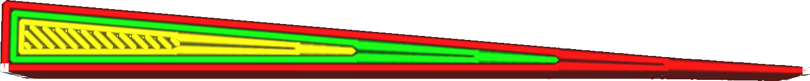

Lengte wandovergang
====
Voor dunne onderdelen passen niet alle wanden in de vorm. Als het onderdeel op sommige plaatsen dunner is dan op andere, zal Cura op sommige plaatsen een ander aantal wanden moeten gebruiken. Deze instelling bepaalt hoe breed het overgangsgebied zal zijn waar een wand wordt toegevoegd of verwijderd.

<!--screenshot {
"image_path": "wall_transition_length_0_2.png",
"modellen": [{"script": "wedge.scad"}],
"camerapositie": [-7, 0, 75],
"instellingen": {"wall_transition_length": 0.2},
"kleuren": 64
}-->
<!--screenshot {
"image_path": "wall_transition_length_1_5.png",
"modellen": [{"script": "wedge.scad"}],
"camerapositie": [-7, 0, 75],
"instellingen": {"wall_transition_length": 1.5},
"kleuren": 64
}-->

Het overgangsgebied tussen een ander aantal wanden is altijd een beetje een probleem. Dit is het duidelijkst wanneer een enkele lijn in het midden eindigt en de twee omringende wanden de opening moeten opvullen. Ze vullen de ruimte niet meteen en er blijft een leemte. Dit resulteert in kleine gaatjes aan de boven- en onderkant van de printen. Het tegenovergestelde is waar wanneer twee wanden in één samensmelten, zodat ze elkaar een moment overlappen totdat ze samenvloeien. Over-extrusie kan maatonnauwkeurigheden veroorzaken, vooral wanneer het op de buitenwand voorkomt. Dit alles kan worden voorkomen door de overgang zo kort mogelijk te houden.

Een korte overgang zorgt er echter ook voor dat de nozzle een aantal zeer scherpe bochten maakt om dat gat snel te vullen. Dit leidt tot meer rinkelen, vooral wanneer dit optreedt bij het printen van de buitenwand. Een langere overgang vermindert de versnellingen in de nozzle, vooral als het onder de [Printschok(jerk)](../speed/jerk_print.md) limiet valt.

Het is logisch om deze lengte in te stellen op 1 of 2 keer de lijndikte. Printers met zwakkere frames of zwaardere printkoppen moeten mogelijk de lengte vergroten, terwijl printers die snel kunnen accelereren zonder overgaan te ervaren, het zich kunnen veroorloven om de overgang te verkorten om de visuele kwaliteit te verbeteren.

**Deze instelling is niet alleen van toepassing op normale wanden, maar ook op wanden met extra skinen, supportwanden, vullingen en concentrische patronen.**