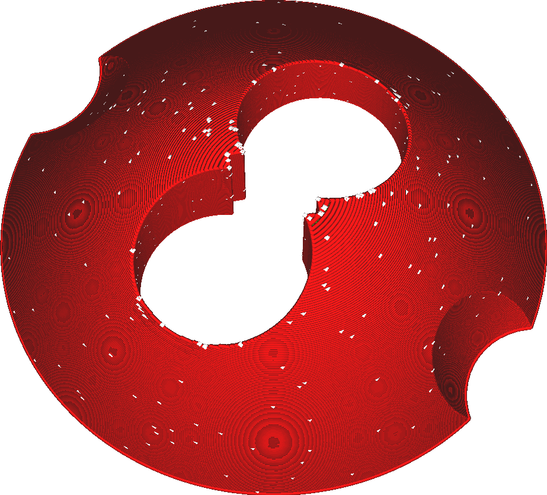

Uitlijning Z-naad
====
Met deze instelling kunt u specificeren waar de naad van elke contour moet worden geplaatst. Er zijn verschillende opties beschikbaar om u nauwkeurige controle te geven over de plaatsing van de naad om de effecten te minimaliseren of om het gemakkelijker te maken om de naad te verwijderen tijdens de nabewerking.

De naad is het punt waar de print van de contour begint en eindigt. Zelfs als het pad van de nozzle een gesloten cirkel is, zal er een naad blijven waar extrusie begint en eindigt, aangezien het printproces nooit helemaal nauwkeurig is. Met deze instelling kan de zichtbaarheid van de naad worden geminimaliseerd door deze ergens te verbergen of te verspreiden.
<!--screenshot {
"image_path": "z_seam_type_user.png",
"modellen": [{"script": "seams_on_curves.scad"}],
"camerapositie": [51, -36, 132],
"instellingen": {
    "z_seam_corner": "z_seam_corner_outer",
    "z_seam_position": "links",
    "z_seam_type": "terug"
},
"kleuren": 32
}-->
Aangepast
----

Met deze optie kunt u handmatig een locatie selecteren. De naad wordt in de hoek geplaatst die zich het dichtst bij de geselecteerde positie bevindt. Hierdoor liggen de hoeken meestal heel dicht bij elkaar, waardoor de naad makkelijk weg te knippen is. Bovendien kan de positie van de naad nauwkeurig worden bepaald.

Standaard is een locatie aan de achterkant van de print geselecteerd. Het idee is dat gebruikers de voorkant van hun modellen naar de voorkant van de printer hebben gericht, zodat een positie op de achterkant de naad beter verbergt.

<!--screenshot {
"image_path": "z_seam_type_shortest.png",
"modellen": [{"script": "seams_on_curves.scad"}],
"camerapositie": [51, -36, 132],
"instellingen": {
    "z_seam_corner": "z_seam_corner_outer",
    "z_seam_type": "kortste"
},
"kleuren": 32
}-->
Kortste
----

Deze optie minimaliseert eenvoudig de verplaats bewegingen naar de naad zonder de naad op een specifieke locatie te plaatsen. Omdat de route korter is, bespaar je wat tijd op de routes. De naad wordt ook iets kleiner omdat er minder slib wordt geplaatst waar de nozzle op de contour terechtkomt.

De gewenste hoek heeft toch de voorkeur door een hoek dicht bij de nozzle te kiezen. Het kiest niet de dichtstbijzijnde hoek, maar gebruikt een berekende voorkeur om de verplaats bewegingen een beetje te minimaliseren, maar ook om een geschikte hoek te gebruiken voor de [Voorkeur van naad en hoek](z_seam_corner.md) instelling.

<!--screenshot {
"image_path": "z_seam_type_random.png",
"modellen": [{"script": "seams_on_curves.scad"}],
"camerapositie": [51, -36, 132],
"instellingen": {
    "z_seam_corner": "z_seam_corner_outer",
    "z_seam_type": "willekeurig"
},
"kleuren": 32
}-->
Toeval
----

Voor de naad wordt een willekeurige plek rond de rand gekozen. Deze willekeurige plek wordt in elke laag veranderd, zodat de naad redelijk gelijkmatig over het model wordt verdeeld. Omdat de naden van de verschillende lagen elkaar niet raken, zal de naad nauwelijks zichtbaar zijn. Het oppervlak ziet er over het algemeen echter wat rommeliger uit.

<!--screenshot {
"image_path": "z_seam_type_sharpest.png",
"modellen": [{"script": "seams_on_curves.scad"}],
"camerapositie": [51, -36, 132],
"instellingen": {
    "z_seam_corner": "z_seam_corner_outer",
    "z_seam_type": "scherpste_hoek"
},
"kleuren": 32
}-->
Scherpste rand
----

De naad wordt in de scherpste rand van de gehele contour geplaatst, afhankelijk van de randvoorkeur die is geselecteerd in de instelling [Voorkeur van naad en hoek](z_seam_corner.md). Dit kan resulteren in grotere verplaats bewegingen, maar zorgt ervoor dat de naad maximaal wordt verborgen of blootgelegd, afhankelijk van de voorkeur die is ingesteld voor de randen.