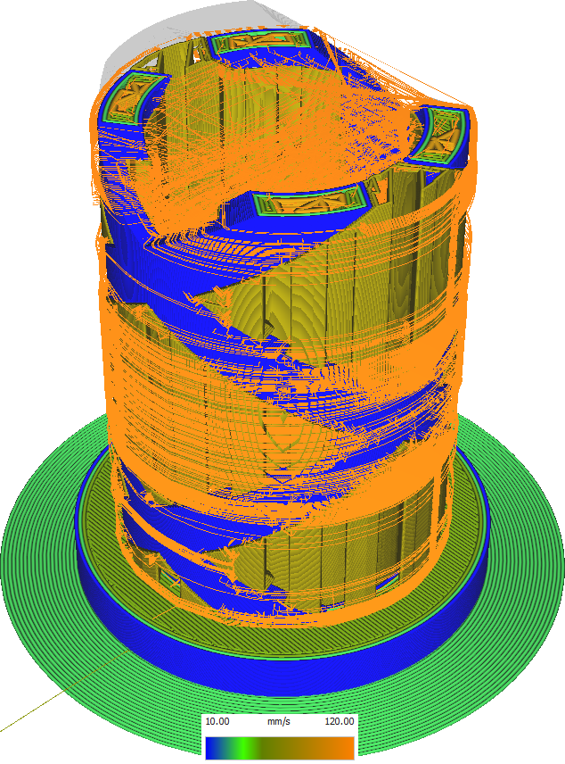

Snelheid Supportstructuur
====
Deze instelling bepaalt de snelheid waarmee de supportstructuren worden geprint.

Meestal hoeft de support niet erg nauwkeurig te worden geprint, dus het is veilig om de support met een hogere snelheid printen dan de rest van de print. Dit kan wat printtijd besparen.

Een te hoge snelheid zal echter resulteren in een verschil in doorvoer tussen de support en de rest van de print, wat resulteert in over-extrusie bij het gaan van support naar print en onder-extrusie bij het gaan van print naar support.