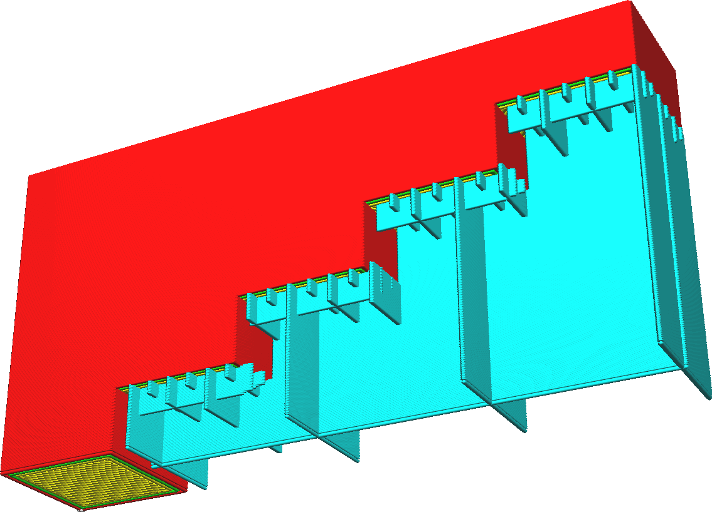

Geleidelijke supportvulling hoogte traptreden
====
Bij geleidelijke support wordt de supportdichtheid periodiek in verschillende stappen van boven naar beneden verminderd. Bij elke stap wordt de dragerdichtheid gehalveerd. Deze instelling specificeert de hoogte van deze treden, d.w.z. de afstand tussen twee punten waar de supportdichtheid wordt gehalveerd.

<!--screenshot {
"image_path": "gradual_support_infill_step_height_1mm.png",
"modellen": [
    {
        "script": "trap.scad",
        "transformatie": ["roterenY(-90)", "scaleZ(0.5)"]
    }
],
"camerapositie": [49, 91, -38],
"instellingen": {
    "support_enable": waar,
    "support_pattern": "raster",
    "support_wall_count": 0,
    "support_infill_rate": 50,
    "gradual_support_infill_steps": 3,
    "gradual_support_infill_step_height": 1
},
"kleuren": 64
}-->
<!--screenshot {
"image_path": "gradual_support_infill_step_height_3mm.png",
"modellen": [
    {
        "script": "trap.scad",
        "transformatie": ["roterenY(-90)", "scaleZ(0.5)"]
    }
],
"camerapositie": [49, 91, -38],
"instellingen": {
    "support_enable": waar,
    "support_pattern": "raster",
    "support_wall_count": 0,
    "support_infill_rate": 50,
    "gradual_support_infill_steps": 3,
    "gradual_support_infill_step_height": 3
},
"kleuren": 64
}-->

Bij geleidelijke support wordt een deel van de support natuurlijk in de lucht gegooid. Dit herstelt zich echter meestal vanzelf, de eerste laag drager hangt in de lucht en past alleen goed aan de zijkanten van de laag. De lagen erboven kunnen aan de uiteinden een beetje leunen op de vorige laag, maar zakken in het midden door. Dit wordt met elke laag beter. Als de hoogte van de geleidelijke support groot genoeg is, is de support goed stabiel op het moment van de volgende toename van verdichting.

Verlaag de hoogte van de geleidelijke supportvullingen om snel af te dalen naar een lage supportdichtheid. Dit bespaart printtijd en materiaalverbruik. Verhoog de geleidelijke  vulhoogte van de support als de support niet genoeg ruimte heeft om zichzelf te herstellen bij de volgende stap van de supportdichtheid. Als u de waarde van deze instelling verhoogt, wordt het printen betrouwbaarder.