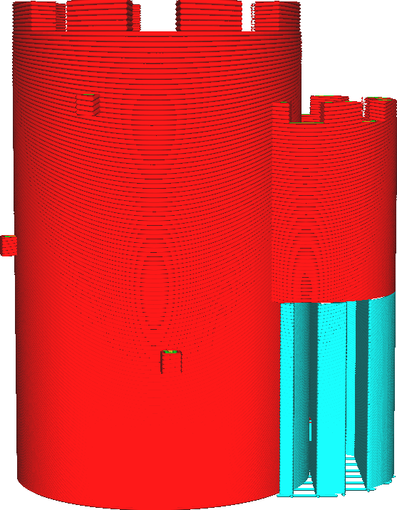

Minimumgebied supportstructuur
====
Deze instelling stelt een minimummaat in voor supportstukken. Als een supportstuk in een bepaalde laag minder oppervlakte heeft dan de waarde van deze instelling, wordt de support daar weggelaten.

<!--screenshot {
"image_path": "minimum_support_area_0.png",
"modellen": [{"script": "kasteel.scad"}],
"camerapositie": [0, 190, 47],
"instellingen": {
    "support_enable": waar,
    "minimum_support_area": ​​​​0
},
"kleuren": 64
}-->
<!--screenshot {
"image_path": "minimum_support_area_10.png",
"modellen": [{"script": "kasteel.scad"}],
"camerapositie": [0, 190, 47],
"instellingen": {
    "support_enable": waar,
    "minimum_support_area": ​​​​10
},
"kleuren": 64
}-->

Deze houding is er omdat dunne supportkolommen gemakkelijk kunnen kantelen. Ze ondersteunenn meestal ook kleine elementen die waarschijnlijk goed zouden printen zonder support. Als de support omvalt, blijven er veel klodders op de print achter. Dus misschien is het beter om die dunne pijlers weg te laten. Met deze instelling kunt u de support uitfilteren op basis van het dwarsdoorsnede-oppervlak van de pijler.

Door het oppervlak te vergroten, wordt er minder support geprint, wat het tijd- en materiaalverbruik iets vermindert. Het belangrijkste is dat de betrouwbaarheid van de print wordt verbeterd omdat er minder risico is dat supportkolommen omvallen. Dit verwijdert echter ook de support voor kleine functies in uw print, zodat de kwaliteit van de overhang voor die onderdelen achteruit kan gaan.

Voor sommige vormen kan dit het vervelende neveneffect hebben dat de bovenkant van de support wordt verwijderd als de bovenkant onder het drempelbereik valt, maar de onderkant niet. Dit kan ertoe leiden dat onderdelen niet worden ondersteund die men normaal zou verwachten te worden ondersteund.

<!--screenshot {
"image_path": "minimum_support_area_problem.png",
"modellen": [{"script": "overhang_bridging_cooling.scad"}],
"camerapositie": [117, 0, 15],
"instellingen": {
    "support_enable": waar,
    "minimum_support_area": ​​​​50
},
"kleuren": 64
}-->
