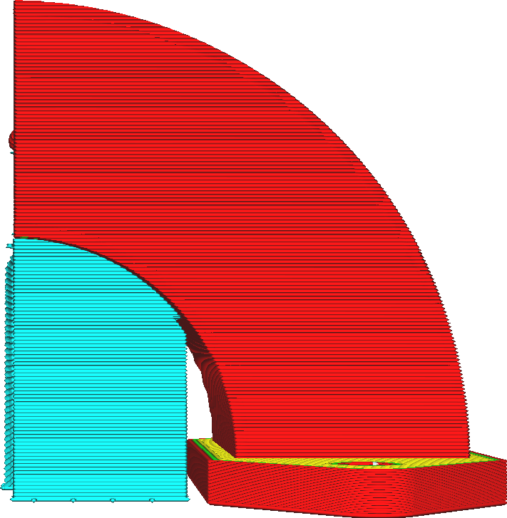

Overhanghoek Supportstructuur
====
De overhanghoek is van invloed op de hoeveelheid materiaal die wordt neergelegd om de print te ondersteunen. De hoek specificeert de minimale hoek die moet worden ondersteund.

**Het verlagen van de waarde van deze instelling resulteert in meer support.**

<!--screenshot {
"image_path": "support_angle_low.png",
"modellen": [{"script": "duct.scad"}],
"camerapositie": [136, 10, 10],
"camera_lookat": [0, 10, 10],
"instellingen": {
    "support_enable": waar,
    "support_join_distance": 0.1,
    "support_angle": 40
},
"kleuren": 64
}-->
<!--screenshot {
"image_path": "support_angle_high.png",
"modellen": [{"script": "duct.scad"}],
"camerapositie": [136, 10, 10],
"camera_lookat": [0, 10, 10],
"instellingen": {
    "support_enable": waar,
    "support_join_distance": 0.1,
    "support_angle": 75
},
"kleuren": 64
}-->
<!--screenshot {
"image_path": "support_angle_prepare_mode.png",
"modellen": [{"script": "duct.scad"}],
"camerapositie": [113, 77, 0],
"laag": -1
}-->

Als u deze instelling verlaagt, kan de printer meer van het geprinte object ondersteunen, zelfs oppervlakken die steiler zijn en niet veel doorzakken tijdens het printen. Als de support onderdelen ondersteund die niet ondersteund hoeven te worden, zal dit de printtijd en het materiaalverbruik onnodig verhogen en littekens veroorzaken waar de support de print raakt.

Soms is het echter nodig om de supporthoek te verkleinen om te voorkomen dat het materiaal te veel doorzakt. Dit verbetert over het algemeen de maatnauwkeurigheid van het voltooide onderdeel en zorgt er ook voor dat de uitsteeksels er beter uitzien.

Als u met support werkt, moet u een voorbeeld bekijken van hoe support eruit zal zien. Daar kun je zien waar de support daadwerkelijk wordt gegenereerd. Het aanpassen van deze instelling is dan een van de tools die je tot je beschikking hebt om te filteren waar precies de support wordt gegenereerd.