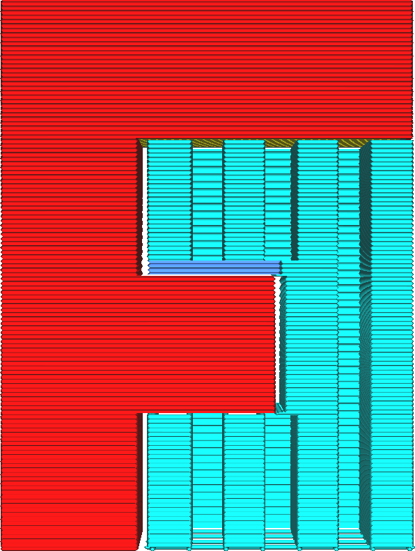

Supportvloer inschakelen
====
De supportvloer is een tussenconstructie tussen de support en het model waarop de support op het model rust. Het kan worden gebruikt om een ​​stabielere basis voor de support te creëren of om de support gemakkelijker van de print te verwijderen en minder littekens achter te laten.

<!--screenshot {
"image_path": "support_bottom_enable.png",
"modellen": [{"script": "f3.scad"}],
"camerapositie": [0, 134, 20],
"instellingen": {
    "support_enable": waar,
    "support_bottom_enable": true
},
"kleuren": 64
}-->

De onderkant van de pupport kan langzamer geprint worden om een ​​stabielere support te krijgen, of er kan een ander materiaal worden gebruikt dat gemakkelijker van het model te verwijderen is. Zo hoef je niet alle support met dat materiaal of instellingen te printen, wat veel printtijd kan besparen.

**De supportvloer wordt niet gemaakt waar de support op de platvorm rust.**