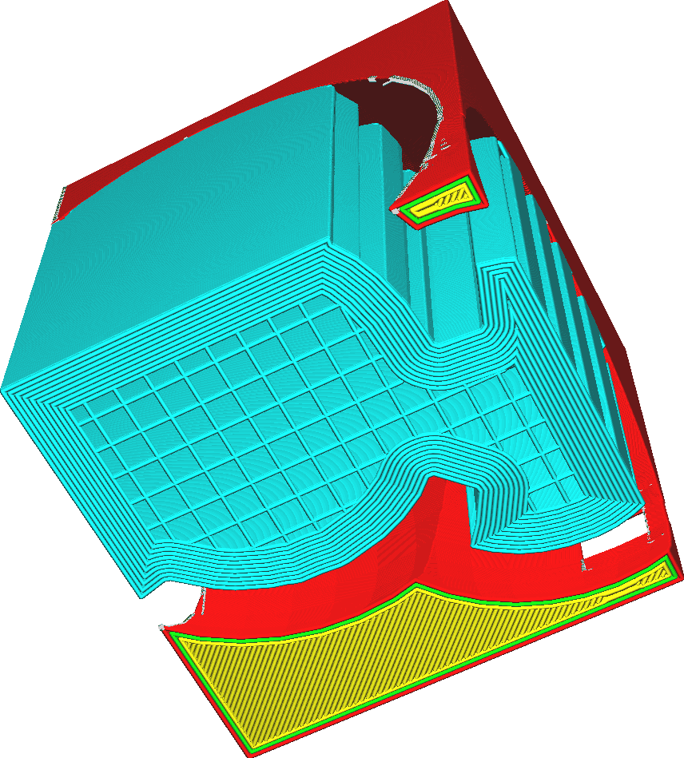

Supportbrim inschakelen
====
Als de supportrand is ingeschakeld, wordt een extra rand binnen het supportgebied van de eerste laag geprint.

<!--screenshot {
"image_path": "support_brim_4mm.png",
"modellen": [{"script": "gazebo2.scad"}],
"camerapositie": [-74, 38, -137],
"instellingen": {
    "support_enable": waar,
    "support_use_towers": false,
    "support_brim_enable": waar,
    "support_brim_width": 4
},
"kleuren": 64
}-->

De supportbrim wordt *naar binnen* getrokken in tegenstelling tot de normale brim. Als het [Type Hechting aan Platform](../platform_adhesion/adhesion_type.md) is ingesteld op Brim, wordt een andere brim *rond* de support getrokken.

Het doel van deze brim is om de support meer oppervlakte te geven om aan de platvorm te hechten. Dit kan ook worden bereikt door de [Lijnafstand Supportstructuur Eerste Laag](support_initial_layer_line_distance.md) aan te passen, maar met deze functie wordt de hechting geconcentreerd rond de rand van het supportgebied, waar het effectiever is om kromtrekken te voorkomen.

Een supportbrim  voegt ook een klein beedje toe aan de printtijd en materiaalkosten, maar omdat het alleen op de eerste laag is, is het zeer minimaal. Dit maakt de support aanzienlijk stabieler, waardoor het moeilijker kan worden om het zigzagpatroon van de support af te breken.