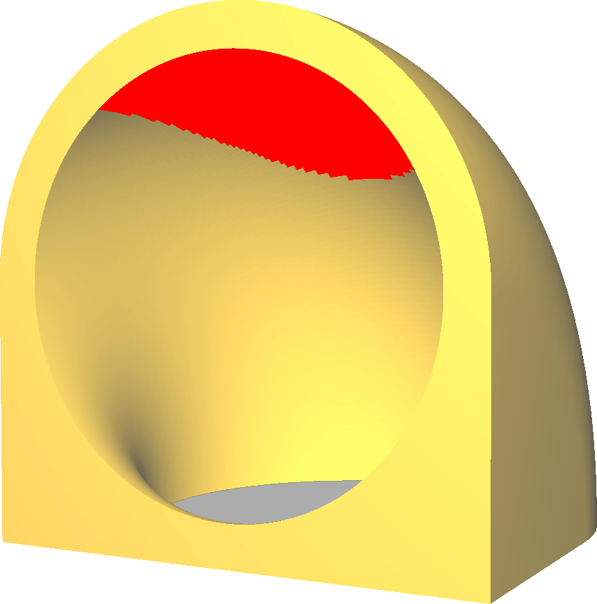
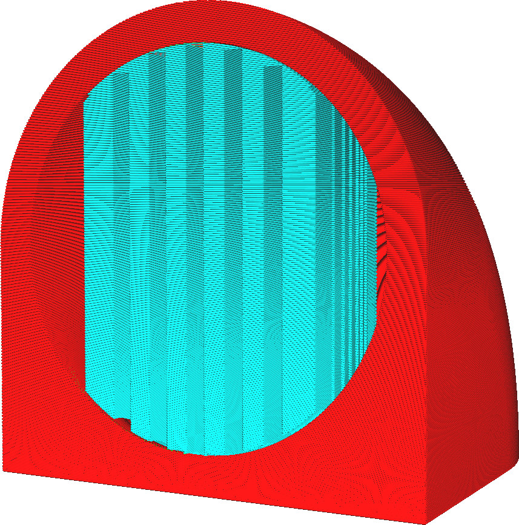

Support genereren
====
3D FFF-printers werken door een streng gesmolten plastic op de juiste plaatsen te plaatsen. Als dit plastic niet wordt ondersteund, zal het doorzakken als het met aanzienlijke kracht en zwaartekracht uit nozzle wordt geduwd. Als het model er niet onder staat om de nieuwe laag te ondersteunen, moet het worden ondersteund door een extra supportstructuur, die wordt verwijderd en weggegooid nadat het model is geprint.

Met deze instelling kunnen supportstructuren worden gemaakt om het object te ondersteunen terwijl het wordt geprint. Cura schakelt deze support niet standaard in, maar het markeert het oppervlak van het model in rood als het denkt dat het materiaal daar veel kan doorzakken als de support niet is ingeschakeld.

<!--screenshot {
"image_path": "support_enable_prepare_mode.png",
"modellen": [{"script": "pipe_corner.scad"}],
"camerapositie": [77, 197, 40],
"laag": -1
}-->
<!--screenshot {
"image_path": "support_enable.png",
"modellen": [{"script": "pipe_corner.scad"}],
"camerapositie": [77, 197, 40],
"settings": {"support_enable": true},
"kleuren": 64
}-->

Printsupport kost veel tijd en materiaal. Waar de support het model raakt, moet deze later worden afgebroken of afgesneden nadat het printproces is voltooid. Dit laat meestal een litteken achter op het oppervlak.

Soms is support echter absoluut noodzakelijk. Als het model bijvoorbeeld een stuk heeft dat naar beneden wijst in de richting van de platvorm, zou dat stuk anders gewoon in de lucht blijven hangen.

Ontwerp om support te vermijden
----

Hoewel dit soms noodzakelijk is, moet printsupport waar mogelijk worden vermeden. Er zijn tal van technieken om te voorkomen dat u support hoeft printen. Dit is een belangrijk onderdeel van het modelontwerp voor 3D-printen. Hieronder staan ​​enkele technieken die u kunt gebruiken om uw 3D-model aan te passen op een manier die geen support vereist.
* Richt uw model zo dat er geen vlakke oppervlakken hoger zijn dan de platvorm.
* Vermijd zoveel mogelijk overhangende delen.
* Als een glad oppervlak zich direct boven de platvorm bevindt, sleept u deze naar beneden op de platvorm.
* Kleine uitsteeksels kunnen in een hoek van 45 graden worden ondersteund door de overhang in het model over te brengen.
* Grotere overhangen kunnen worden overbrugt indien aan beide zijden ondersteund. Cura past de lijnen van de onderkant van de overhang automatisch aan zodat deze in een rechte lijn over de brug lopen. Tijdens het printen van deze lijnen houdt nozzle spanning op de strip zodat deze niet doorhangt. Dit geeft het voldoende tijd om te stollen, zodat het zijn mannetje kan staan.
* Als er een opening in de overhang is, kan een zogenaamde opofferingsbrug worden gepland. Dit is een laag waarin de opening wordt gesloten. Dit zorgt voor een goede overbrugging, waardoor de tweede laag de juiste wanden van de opening eroverheen kan bouwen. Na het printen kan de opening met een mes worden geopend, omdat deze slechts één laag dik is.