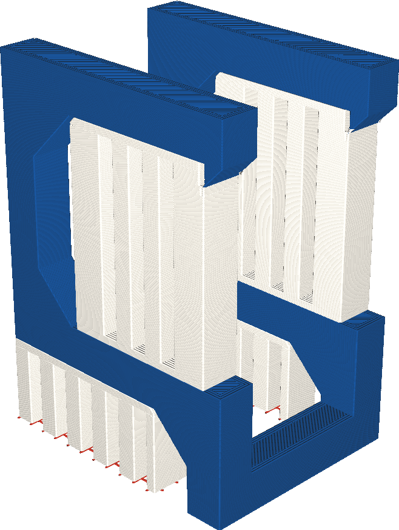

Extruder Eerste Laag van Support
====
Als uw printer is uitgerust met meerdere extruders, kan de supportlaag die op de platformrust, worden geprint met een andere extruder dan de rest van de support. Met deze instelling kunt u kiezen welke extruder u wilt gebruiken voor de eerste supportlaag.

<!--screenshot {
"image_path": "support_extruder_nr_layer_0.png",
"modellen": [
    {
        "script": "question_stick_clip.scad",
        "transformatie": ["roterenY(90)"],
        "object_settings": {"extruder_nr": 1}
    }
],
"camerapositie": [134, 134, 113],
"instellingen": {
    "support_enable": waar,
    "support_interface_enable": waar,
    "support_use_towers": false,
    "support_extruder_nr": 3,
    "support_extruder_nr_layer_0": 2
},
"color_scheme": "materiaal_kleur",
"kleuren": 64
}-->

Sommige materialen zijn beter geschikt voor printsupport dan andere. Dit zijn vaak inerte materialen die niet goed hechten aan andere materialen en daardoor makkelijker te verwijderen zijn. Deze eigenschap is echter niet wenselijk voor de hechting op de platform. Voor de eerste laag kan dan een materiaal worden gebruikt dat beter hecht op de platformen waar het normale supportmateriaal beter op kan hechten dan op glas of aluminium.