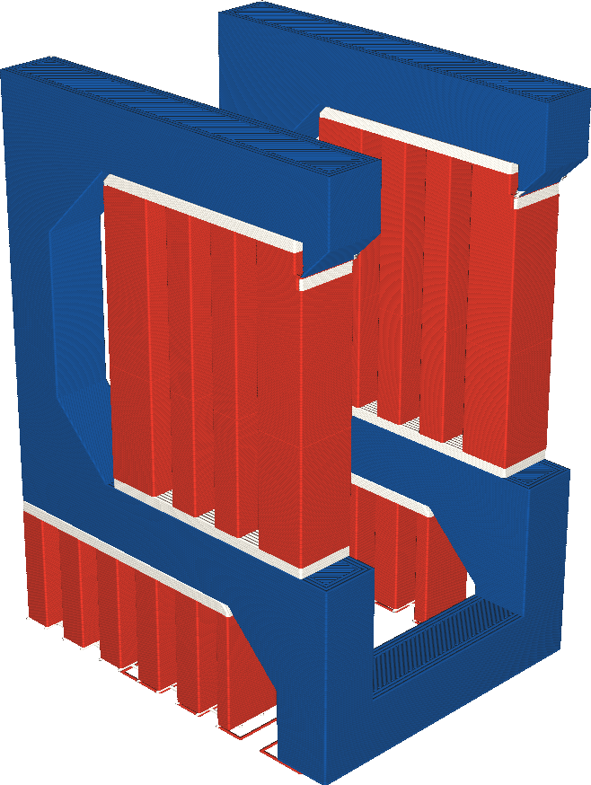

Extruder Supportvulling
====
Als uw printer is uitgerust met meerdere extruders, kan het hoofdgedeelte van de support worden geprint met een andere extruder dan de supportinterface. Met deze instelling kunt u kiezen welke extruder wordt gebruikt voor het hoofdgedeelte van de support.

<!--screenshot {
"image_path": "support_infill_extruder_nr.png",
"modellen": [
    {
        "script": "question_stick_clip.scad",
        "transformatie": ["roterenY(90)"],
        "object_settings": {"extruder_nr": 1}
    }
],
"camerapositie": [134, 134, 113],
"instellingen": {
    "support_enable": waar,
    "support_interface_enable": waar,
    "support_use_towers": false,
    "support_extruder_nr": 3,
    "support_infill_extruder_nr": 2
},
"color_scheme": "materiaal_kleur",
"kleuren": 64
}-->

Sommige materialen zijn beter voor het printen van dragers dan andere, maar deze materialen kunnen ook duurder of langzamer zijn om te printen. Alleen de structuur printen met het dure materiaal, maar het grootste deel van de model printen met een goedkoper materiaal kan veel tijd en geld besparen. De structuur is nog steeds geprint met het dure materiaal, zodat het deel dat het model raakt er goed uitziet of gemakkelijker af te breken is, maar het grootste deel van de support is geprint met het goedkopere materiaal.

Als u oplosbare materialen gebruikt om de ondersteuningsinterface te printen, maar onoplosbare materialen om de vulling van de support af te drukken, moet u er rekening mee houden dat de vulling mogelijk niet uit holtes kan worden verwijderd als het fysiek onmogelijk is om de supportvulling door een kleine opening. Waar normaal gesproken een oplosbaar materiaal door een holte in oplossing naar buiten kan stromen, kunnen onoplosbare materialen er mogelijk niet doorheen.