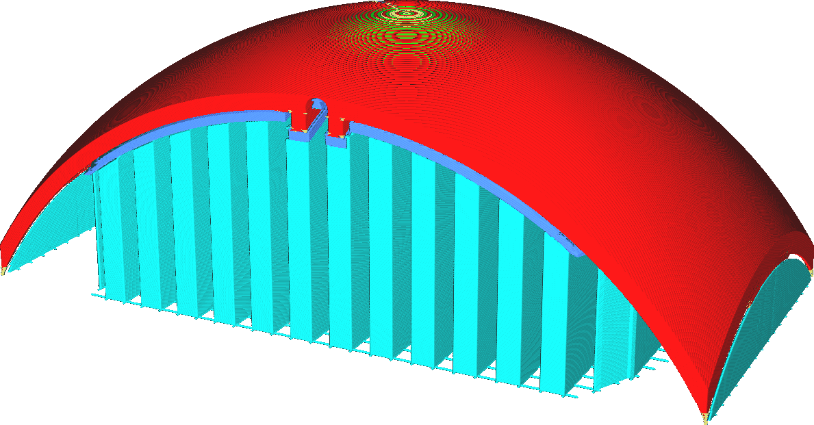

Verbindingsstructuur Inschakelen
====
Een "Verbindingsstructuur" is een intermediaire structuur tussen de normale support en het model. Deze structuur kan de eigenschappen van de supportmodelstructuurs aanpassen zonder het grootste deel van de support significant te beïnvloeden.

<!--screenshot {
"image_path": "support_interface_enable.png",
"modellen": [{"script": "trash_bin_lid.scad"}],
"camerapositie": [93, 188, 87],
"instellingen": {
    "support_enable": waar,
    "support_interface_enable": true
},
"kleuren": 64
}-->

Standaard zijn de tussenlagen dichter dan normale support. Dit geeft een beter overhangoppervlak zonder veel extra materiaal en printtijd te gebruiken. Het verwijderen van support is echter moeilijker.

Het drageroppervlak kan ook geprint worden met een andere extruder dan de rest van de drager. Sommige ondersupportende printmaterialen kunnen erg duur en traag zijn om printen. Op deze manier wordt het grootste deel van de support geprint met het goedkopere of snellere materiaal, maar de structuur waar het gebruik van het supportmateriaal een rol speelt, wordt geprint met het materiaal van hogere kwaliteit.