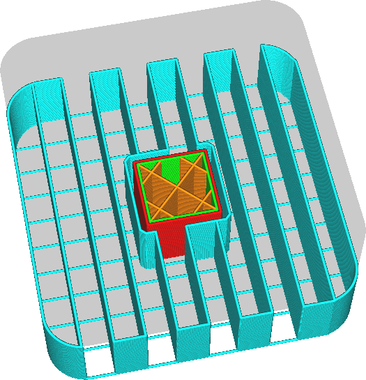
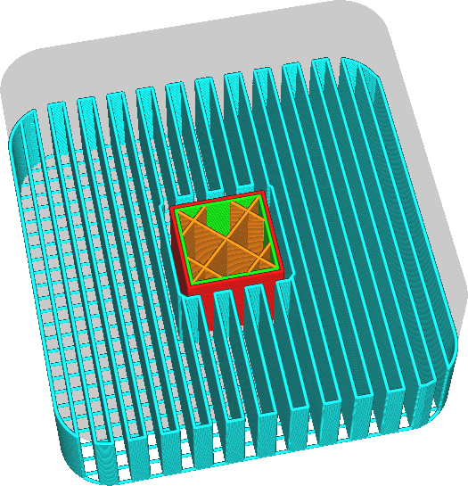

Lijnafstand van de Supportstructuur
====
Deze instelling definieert de afstand tussen twee aangrenzende lijnen in het supportpatroon. Dit type supportdichtheidsaanpassing is misschien intuïtiever dan supportdichtheidsaanpassing, omdat het direct de afstand aanpast die de ondersupportde lijnen moeten overspannen.

<!--screenshot {
"image_path": "support_infill_rate_low.png",
"modellen": [{"script": "spiral_stair.scad"}],
"camerapositie": [-95, 18, 116],
"instellingen": {
    "support_enable": waar,
    "support_infill_rate": 10
},
"laag": 256,
"kleuren": 64
}-->
<!--screenshot {
"image_path": "support_infill_rate_high.png",
"modellen": [{"script": "spiral_stair.scad"}],
"camerapositie": [-95, 18, 116],
"instellingen": {
    "support_enable": waar,
    "support_infill_rate": 20
},
"laag": 256,
"kleuren": 64
}-->

Het verkleinen van de afstand tussen supportlijnen heeft een aantal positieve en negatieve effecten. Hier zijn enkele van de implicaties om te overwegen:
* Het oppervlak dat op deze support rust zal minder doorzakken omdat er minder ruimte is om tussen de twee supporten te overbruggen.
* De support is stabieler, wat de betrouwbaarheid van het printen verhoogt.
* Het is moeilijker om de support te verwijderen omdat het kleefoppervlak groter is.
* Er is meer materiaal nodig om de drager printen.
* printen duurt langer.