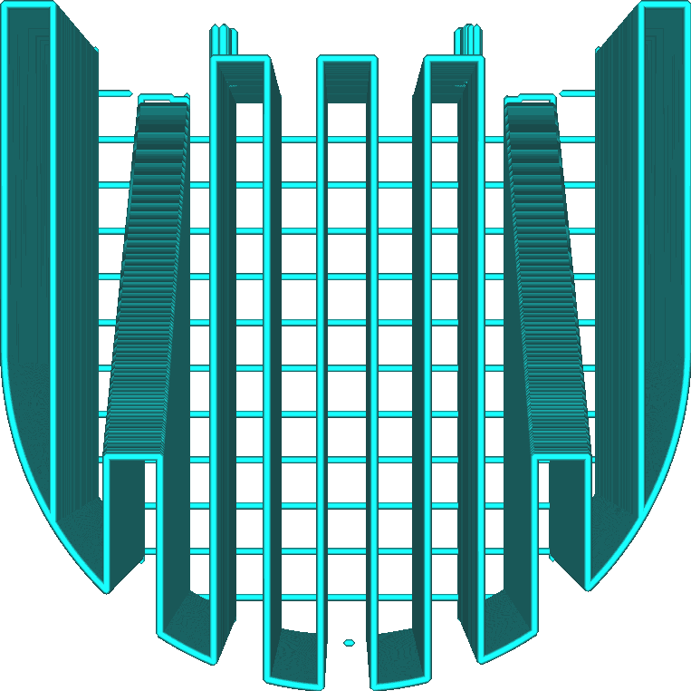

Patroon Supportstructuur
====
Met deze instelling kunt u het patroon kiezen dat u wilt gebruiken om het volume van de supportstructuur te vullen. Verschillende patronen hebben verschillende sterke en zwakke punten.

<!--screenshot {
"image_path": "support_pattern_lines.png",
"modellen": [
    {
        "script": "calendar_holder.scad",
        "transformatie": ["rotateX(90)"]
    }
],
"camerapositie": [0, 0, 135],
"instellingen": {
    "support_enable": waar,
    "support_pattern": "lijnen"
},
"structuren": ["helpers"],
"kleuren": 16
}-->
Lijnen
----

Het lijnenpatroon tekent rechte lijnen. De lijnen zijn zo uitgelijnd dat ze nooit loodrecht staan ​​op de lijnen van de skin die deze moet ondersupporten (standaard).
* Van alle patronen is deze het makkelijkst te verwijderen uit het model. Dit is erg handig wanneer er een overhangend gebied is dat zich dicht bij de platvorm bevindt. Indien nodig kunnen de resten met een mes worden weggesneden.
* Biedt de beste overhangkwaliteit van elk patroon, samen met zigzag. De lijnen liggen zeer dicht bij elkaar en zijn zo uitgelijnd dat ze niet loodrecht op de skin staan.
* Heeft de neiging onstabiel te zijn omdat de lijnen de neiging hebben om te kantelen.

<!--screenshot {
"image_path": "support_pattern_grid.png",
"modellen": [
    {
        "script": "calendar_holder.scad",
        "transformatie": ["rotateX(90)"]
    }
],
"camerapositie": [0, 0, 135],
"instellingen": {
    "support_enable": waar,
    "support_pattern": "raster"
},
"structuren": ["helpers"],
"kleuren": 16
}-->
Raster
----

Het rasterpatroon tekent twee reeksen rechte lijnen die loodrecht op elkaar staan. Ze overlappen elkaar en vormen een patroon van vierkanten. Standaard wordt er een omtrek om dit patroon geprint.
* Zeer stabiel, groeit betrouwbaar.
* Biedt middelmatige overhangkwaliteit omdat de lijnen vrij ver uit elkaar liggen.
* Kan moeilijk te verwijderen zijn omdat de support niet veel buigt.

<!--screenshot {
"image_path": "support_pattern_triangles.png",
"modellen": [
    {
        "script": "calendar_holder.scad",
        "transformatie": ["rotateX(90)"]
    }
],
"camerapositie": [0, 0, 135],
"instellingen": {
    "support_enable": waar,
    "support_pattern": "driehoeken"
},
"structuren": ["helpers"],
"kleuren": 16
}-->
Driehoeken
----

Het driehoekspatroon tekent drie reeksen rechte lijnen in een hoek van 60 graden ten opzichte van elkaar en vormt een patroon van gelijkzijdige driehoeken. Standaard wordt er een omtrek om dit patroon geprint.
* De meest stabiele van alle supportpatronen.
* Biedt een slechte overhangkwaliteit omdat de lijnen erg ver uit elkaar liggen.
* Kan moeilijk te verwijderen zijn omdat de support in geen enkele richting buigt.

<!--screenshot {
"image_path": "support_pattern_concentric.png",
"modellen": [
    {
        "script": "calendar_holder.scad",
        "transformatie": ["rotateX(90)"]
    }
],
"camerapositie": [0, 0, 135],
"instellingen": {
    "support_enable": waar,
    "support_pattern": "concentrisch"
},
"structuren": ["helpers"],
"kleuren": 16
}-->
Concentrisch
----

Het concentrische patroon zorgt ervoor dat de support bestaat uit concentrische ringen die gelijkmatig van buiten naar binnen zijn verdeeld.
* De lijnen liggen dicht bij elkaar en bieden een goede support voor de overhangende delen, waardoor een glad oppervlak ontstaat wanneer de lijnen verticaal zijn georiënteerd.
* Redelijk stabiel omdat de lussen afzonderlijk een grote breedte hebben om op te staan.
* Gemakkelijk te verwijderen omdat de draagstructuur iets naar binnen buigt.
* Het eindigt vaak evenwijdig aan de wanden die het moet ondersteunen. Dit resulteert in een slechtere kwaliteit van de overhang omdat sommige wanden helemaal niet ondersreund worden.
* Zorgt er soms voor dat de support in de lucht zweeft.

<!--screenshot {
"image_path": "support_pattern_zigzag.png",
"modellen": [
    {
        "script": "calendar_holder.scad",
        "transformatie": ["rotateX(90)"]
    }
],
"camerapositie": [0, 0, 135],
"instellingen": {
    "support_enable": waar,
    "support_pattern": "zigzag"
},
"structuren": ["helpers"],
"kleuren": 16
}-->
Zigzag
----

Het zigzagpatroon lijkt op het lijnpatroon, maar de lijnen zijn aan de uiteinden verbonden.
* Redelijk stabiel, wat de betrouwbaarheid aanzienlijk verhoogt.
* Biedt de beste overhangkwaliteit van alle patronen samen met het lijnpatroon. De lijnen liggen zeer dicht bij elkaar en zijn zo uitgelijnd dat ze niet loodrecht op de skin staan.
* Gemakkelijk te verwijderen. De supportstructuur buigt naar binnen en wanneer eraan wordt getrokken, trekt de support in stroken weg.
* Support wordt bijna altijd in een enkele lijn getrokken, waardoor de noodzaak voor terugtrekken of verplaatsbewegingen tot een minimum wordt beperkt.

<!--screenshot {
"image_path": "support_pattern_cross.png",
"modellen": [
    {
        "script": "calendar_holder.scad",
        "transformatie": ["rotateX(90)"]
    }
],
"camerapositie": [0, 0, 135],
"instellingen": {
    "support_enable": waar,
    "support_pattern": "kruis"
},
"structuren": ["helpers"],
"kleuren": 16
}-->
Kruis
----

Het kruispatroon tekent een gebroken patroon met kruisachtige vormen door het hele volume.
* Van alle patronen is deze het gemakkelijkst te buigen omdat er geen lange rechte lijnen in dit patroon zitten.
* Support wordt bijna altijd in een enkele lijn getrokken, waardoor de noodzaak voor terugtrekken of verplaatsbewegingen tot een minimum wordt beperkt.

<!--screenshot {
"image_path": "support_pattern_gyroid.png",
"modellen": [
    {
        "script": "calendar_holder.scad",
        "transformatie": ["rotateX(90)"]
    }
],
"camerapositie": [0, 0, 135],
"instellingen": {
    "support_enable": waar,
    "support_pattern": "gyroïde"
},
"structuren": ["helpers"],
"kleuren": 16
}-->
<!--if cura_version >= 4.1-->
Gyroide
----

Het gyroïdepatroon is golvend, met een curve die heen en weer slingert. De curve varieert over lagen.
* Redelijk stabiel patroon dat de betrouwbaarheid verhoogt.
* De lucht tussen de supporten is een enkel volume. Bij het printen met oplosbare ondersupportende materialen kan het oplosmiddel (water, ethanol of iets anders) het hele interieur van de ondersupportende structuur doordringen, zelfs als er een rand onder zit. Hierdoor kan de support sneller worden opgelost.
* Ondersteund alle lijnen in de overhang gelijkelijk, ongeacht hun richting.
<!--endif-->